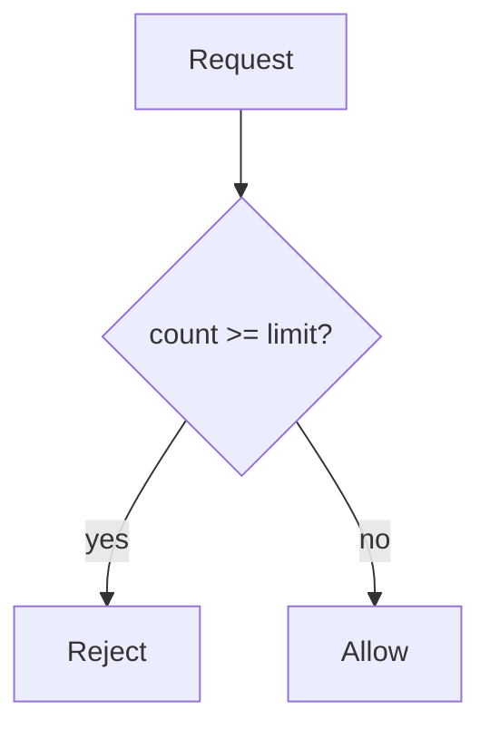

# Programming Fundamentals

## Why it matters
Backend systems are built from simple building blocks. Strong fundamentals make
your code predictable and easier to reason about under pressure.

## Progression checkpoints
| Level | Focus |
| --- | --- |
| Beginner | Variables, control flow, and functions. |
| Intermediate | Modularize code and reuse functions safely. |
| Senior | Design APIs and handle edge cases consistently. |
| Principal | Set coding standards and review guidelines. |

## Key concepts
- Data types, variables, and operators.
- Control flow: if/else, loops, early returns.
- Functions and parameter passing.
- Input validation and basic error handling.

## Detailed explanation
- **Data types and variables** define how values are stored and manipulated.
  Choosing the right type prevents bugs (for example, using integers for counts
  and decimals for money) and avoids accidental type coercion.
- **Control flow** determines which code executes under which conditions.
  Early returns reduce nesting and make error paths clear, which matters when
  handling invalid inputs or partial failures.
- **Functions** turn repeated logic into reusable building blocks. Treat
  function boundaries as small APIs: define clear inputs, outputs, and side
  effects to keep behavior predictable.
- **Input validation** is your first line of defense. Validate at boundaries,
  return actionable errors, and avoid passing bad data deeper into the system.
- **Type conversions** deserve explicit handling. Most inputs arrive as strings
  (CLI args, HTTP, config files), so normalize and validate before you rely on
  numeric or boolean semantics.
- **Loop invariants** help you reason about correctness. Decide what must be
  true each iteration (for example, "processed items <= limit") to avoid
  off-by-one errors and runaway loops.

## Real-world example: Simple rate limiter
A small script rejects requests after a threshold.

```python
def allow_request(count, limit):
    if count >= limit:
        return False
    return True
```

## Diagram


## Additional real-world examples
- Parsing CLI flags and environment variables, failing fast when required
  settings are missing.
- Normalizing user input (trim, lowercase) before storing to avoid duplicates.
- Incrementing retry counters with a max cap to prevent infinite retries.

## Practical checklist
- Use guard clauses for invalid input.
- Keep functions small and focused.
- Write tests for common and edge cases.

## Official documentation
- https://docs.python.org/3/tutorial/controlflow.html
- https://docs.oracle.com/javase/tutorial/java/nutsandbolts/index.html
- https://go.dev/ref/spec#Statements
- https://doc.rust-lang.org/book/ch03-03-how-functions-work.html
