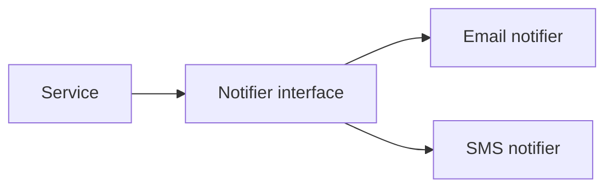

# Structures and Modularity

## Why it matters
Well-structured code scales with the team. Modularity reduces coupling and
makes changes safer.

## Progression checkpoints
| Level | Focus |
| --- | --- |
| Beginner | Use structs/classes to group data. |
| Intermediate | Apply interfaces and composition. |
| Senior | Create stable module boundaries. |
| Principal | Define shared libraries and conventions. |

## Key concepts
- Structs/classes and encapsulation.
- Interfaces and dependency inversion.
- Composition over inheritance.
- Modules and packaging.

## Detailed explanation
- **Structs/classes and encapsulation** group related data and behavior. By
  hiding internal details behind methods, you reduce the chance that callers
  rely on implementation specifics.
- **Interfaces** define contracts between components. When higher-level code
  depends on interfaces instead of concrete implementations, swapping
  dependencies or testing becomes much easier.
- **Composition over inheritance** favors small, reusable parts that can be
  combined. Deep inheritance hierarchies are hard to reason about and often
  leak state in unexpected ways.
- **Modules and packaging** set boundaries for ownership and reuse. A good
  module exposes a small public surface and keeps internal helpers private.
- **Dependency injection** keeps construction separate from usage. When modules
  receive dependencies via parameters or constructors, you can swap
  implementations without editing call sites.
- **Stable module boundaries** reduce churn. Expose only what downstream users
  need, version public interfaces carefully, and keep internal helpers scoped
  to the module.

## Real-world example: Notification providers
An app sends notifications via email or SMS. A common interface makes it easy
to add providers.

```python
class Notifier:
    def send(self, user_id, message):
        raise NotImplementedError()

class EmailNotifier(Notifier):
    def send(self, user_id, message):
        return True

class SmsNotifier(Notifier):
    def send(self, user_id, message):
        return True
```

## Diagram


## Additional real-world examples
- Storage abstraction that swaps local disk, S3, or GCS without changing the
  calling code.
- Feature-flag module that centralizes rollout logic instead of scattering
  conditional checks throughout handlers.
- Plugin-based payment providers where each integration conforms to the same
  interface.

## Practical checklist
- Keep modules small and cohesive.
- Avoid cyclic dependencies.
- Prefer composition to deep inheritance chains.

## Official documentation
- https://docs.python.org/3/tutorial/classes.html
- https://docs.oracle.com/javase/tutorial/java/concepts/
- https://go.dev/doc/code
- https://learn.microsoft.com/en-us/dotnet/standard/
