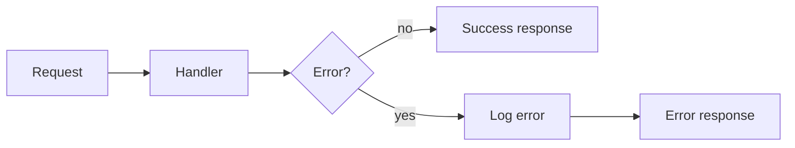

# Error Handling and Logging

## Why it matters
Errors happen in production. Consistent error handling and logs speed up
debugging and reduce outages.

## Progression checkpoints
| Level | Focus |
| --- | --- |
| Beginner | Return errors and avoid silent failures. |
| Intermediate | Standardize error codes and messages. |
| Senior | Use structured logs and correlation IDs. |
| Principal | Define logging standards and retention policies. |

## Key concepts
- Error propagation vs swallowing errors.
- Typed errors and error codes.
- Structured logging and log levels.
- Correlation IDs for request tracing.

## Real-world example: API error response
A service returns a consistent error shape with a request ID for debugging.

```json
{
  "error": {
    "code": "USER_NOT_FOUND",
    "message": "User does not exist",
    "request_id": "req-7f9a"
  }
}
```

## Diagram


## Practical checklist
- Never hide errors; return or log them.
- Add request IDs to logs and responses.
- Avoid logging sensitive data.
