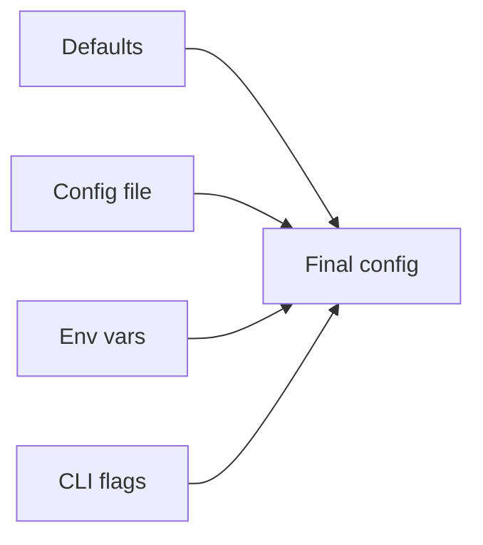

# CLI, Files, and Environment

## Why it matters
Backend services rely on configuration, files, and environment variables. A
consistent approach prevents misconfiguration incidents.

## Progression checkpoints
| Level | Focus |
| --- | --- |
| Beginner | Read files and use command-line arguments. |
| Intermediate | Load configuration from env and files. |
| Senior | Define config precedence and validation rules. |
| Principal | Standardize config patterns across services. |

## Key concepts
- CLI arguments, flags, and help output.
- File I/O and serialization (JSON/YAML).
- Environment variables and secrets.
- Configuration validation and defaults.

## Detailed explanation
- **CLI arguments and flags** make tools self-documenting. Clear usage output
  and sensible defaults reduce support burden and misconfiguration.
- **File I/O and serialization** are common integration points. Validate data
  when reading, and write outputs atomically to avoid partial files.
- **Environment variables** are ideal for runtime configuration but not for
  storing secrets in plain text. Use a secrets manager for sensitive values.
- **Configuration validation** should fail fast at startup with clear errors.
  This avoids ambiguous runtime behavior and hidden defaults.

## Real-world example: Config loader
A service loads config from flags, env, and a file.

```text
Precedence: flags > env > config file > defaults
```

## Diagram


## Practical checklist
- Validate required config at startup.
- Avoid putting secrets in files or logs.
- Document every config key with purpose.
