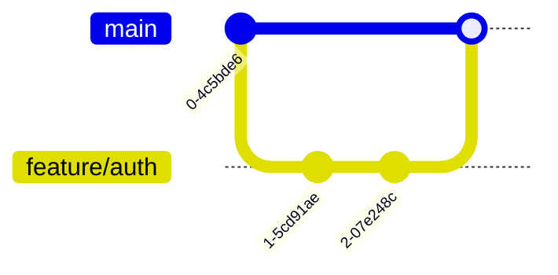

# Version Control Workflow

## Why it matters
Git workflows enable collaboration, traceability, and safe changes.

## Progression checkpoints
| Level | Focus |
| --- | --- |
| Beginner | Commit changes and resolve conflicts. |
| Intermediate | Use branches and pull requests. |
| Senior | Enforce review practices and release tagging. |
| Principal | Define org-wide workflow and branching strategy. |

## Key concepts
- Commits, branches, merges, and rebase.
- Code review and pull request workflow.
- Tagging releases and semantic versioning.
- Git hooks and CI integration.

## Detailed explanation
- **Commits and branches** create a traceable history. Small, focused commits
  help reviewers and make rollbacks safer.
- **Code reviews** catch defects and spread knowledge. Clear review standards
  reduce subjective feedback and improve consistency.
- **Release tags** identify exactly what is deployed. Semantic versioning
  communicates compatibility expectations to downstream users.
- **Git hooks and CI** enforce quality gates early. Automating checks prevents
  broken code from reaching main branches.
- **Rebase vs merge** affects history shape. Rebasing keeps linear history,
  while merge commits preserve full context of parallel work.
- **Signed commits/tags** add provenance. They help verify that release code
  came from trusted maintainers.

## Real-world example: Feature branch workflow
Developers create a feature branch, open a PR, and merge after review.

## Additional real-world examples
- Hotfix branch cut from the last release tag, merged back after production
  incident resolution.
- Release pipeline that tags `v1.2.0` and deploys exactly that commit to
  staging and production.
- Pre-commit hook that runs formatting and unit tests before pushing changes.

## Practical checklist
- Write clear commit messages.
- Keep PRs small and focused.
- Require CI checks before merge.

## Official documentation
- https://git-scm.com/docs
- https://git-scm.com/docs/githooks
- https://docs.github.com/en/pull-requests
- https://semver.org/
