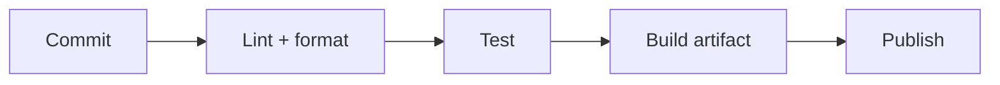

# Tooling and Builds

## Why it matters
Reliable tooling reduces errors and keeps teams productive.

## Progression checkpoints
| Level | Focus |
| --- | --- |
| Beginner | Use formatters and linters locally. |
| Intermediate | Manage dependencies and builds. |
| Senior | Automate checks in CI. |
| Principal | Standardize tooling across teams. |

## Key concepts
- Formatters and linters.
- Dependency management and lock files.
- Build systems and artifacts.
- CI hooks and quality gates.

## Real-world example: CI pipeline for a service
A pipeline formats code, runs tests, and publishes an artifact.

## Diagram

## Practical checklist
- Pin dependencies with lock files.
- Fail fast on lint and test failures.
- Keep build steps documented and repeatable.
