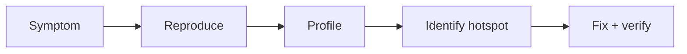

# Debugging and Profiling

## Why it matters
Debugging and profiling turn incidents into clear fixes. They also prevent
performance regressions.

## Progression checkpoints
| Level | Focus |
| --- | --- |
| Beginner | Use breakpoints and logs to inspect state. |
| Intermediate | Reproduce bugs with minimal examples. |
| Senior | Profile CPU and memory bottlenecks. |
| Principal | Create debugging playbooks for teams. |

## Key concepts
- Breakpoints, watch expressions, and log inspection.
- Reproduction steps and minimal failing cases.
- CPU and memory profiling.
- Flame graphs and hotspots.

## Real-world example: Slow endpoint
A report endpoint slows down. Profiling reveals a slow JSON serialization step.

## Diagram

## Practical checklist
- Always capture exact inputs and timestamps.
- Profile with realistic traffic when possible.
- Verify fixes with regression tests.
