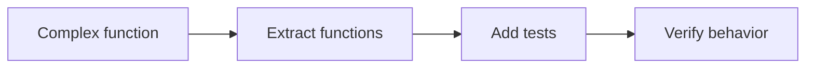

# Clean Code and Refactoring

## Why it matters
Clean code lowers cognitive load and makes maintenance cheaper.

## Progression checkpoints
| Level | Focus |
| --- | --- |
| Beginner | Use clear naming and small functions. |
| Intermediate | Refactor safely with tests. |
| Senior | Reduce complexity and tech debt. |
| Principal | Define code quality standards. |

## Key concepts
- Naming conventions and readability.
- Refactoring patterns: extract function, simplify conditionals.
- Cyclomatic complexity and code smells.
- Incremental improvements with tests.

## Detailed explanation
- **Naming and readability** reduce cognitive load. Clear names make intent
  obvious and reduce the need for comments or guesswork.
- **Refactoring patterns** change structure without changing behavior. Small
  steps like extracting functions or simplifying conditionals are safer and
  easier to review.
- **Cyclomatic complexity** signals risk. High-complexity functions are harder
  to test and more likely to contain subtle bugs.
- **Incremental refactoring with tests** provides safety. Add tests before
  structural changes to prevent regressions.

## Real-world example: Payment rules refactor
A payment rule engine has nested conditions. The team extracts rules into
smaller functions and adds unit tests.

## Diagram

## Practical checklist
- Refactor in small, reviewable steps.
- Add tests before structural changes.
- Avoid premature abstraction.
