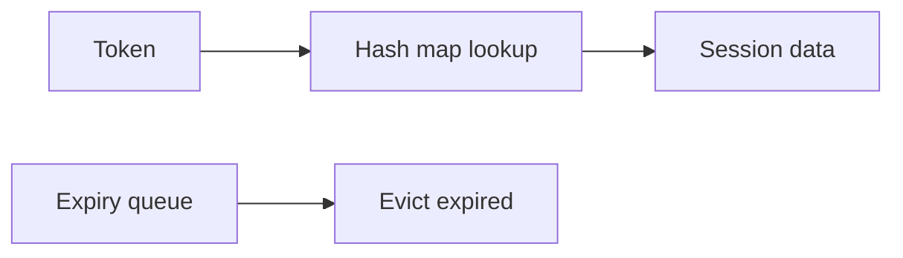

# Core Data Structures

## Why it matters
Choosing the right structure keeps code fast and simple.

## Progression checkpoints
| Level | Focus |
| --- | --- |
| Beginner | Arrays, lists, stacks, queues. |
| Intermediate | Hash maps and sets. |
| Senior | Choose structures based on access patterns. |
| Principal | Define standards for common workloads. |

## Key concepts
- Arrays vs linked lists.
- Stacks and queues for LIFO/FIFO.
- Hash maps and sets for O(1) lookup.
- Tradeoffs: memory, iteration, and ordering.

## Real-world example: Session store
A gateway keeps a map of session tokens for quick lookup and a queue for expiry.

## Diagram

## Practical checklist
- Use hash maps for frequent lookups.
- Use queues for time-ordered processing.
- Avoid linked lists unless insertions dominate.
