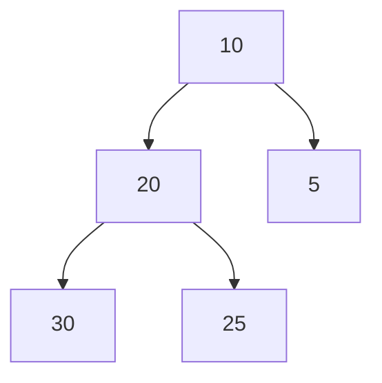

# Trees and Heaps

## Why it matters
Trees enable fast search and ordering. Heaps power priority scheduling.

## Progression checkpoints
| Level | Focus |
| --- | --- |
| Beginner | Understand tree terminology and traversal. |
| Intermediate | Use heaps and balanced trees. |
| Senior | Choose trees for range queries and ordering. |
| Principal | Establish patterns for indexing and scheduling. |

## Key concepts
- Binary search trees and balancing.
- Heaps for priority queues.
- Tries for prefix search.
- Tree traversal (in-order, pre-order, post-order).

## Real-world example: Job scheduler
A background worker uses a min-heap to schedule jobs by next run time.

## Diagram

## Practical checklist
- Use balanced trees for ordered data.
- Use heaps for scheduling and top-K problems.
- Avoid deep recursion on unbalanced trees.
