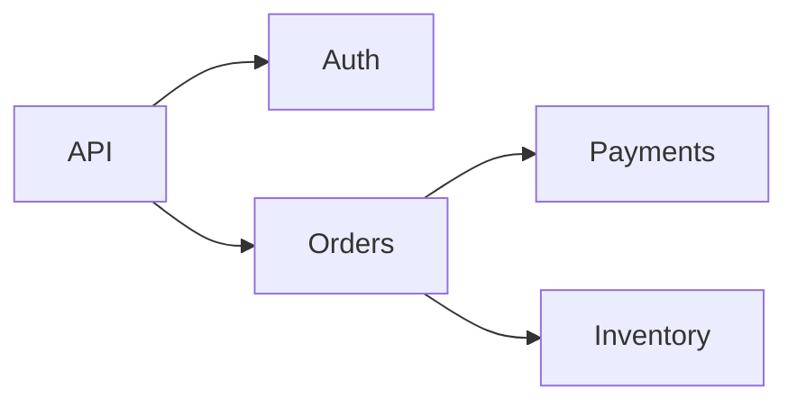

# Graphs and Pathfinding

## Why it matters
Graphs model relationships: services, routes, and dependencies.

## Progression checkpoints
| Level | Focus |
| --- | --- |
| Beginner | Represent graphs and traverse them. |
| Intermediate | Use BFS/DFS for reachability. |
| Senior | Apply shortest path algorithms. |
| Principal | Use graphs for system dependency analysis. |

## Key concepts
- Adjacency list vs adjacency matrix.
- BFS and DFS traversal.
- Shortest path: Dijkstra and Bellman-Ford.
- Topological sorting for DAGs.

## Real-world example: Service dependencies
A platform maps service dependencies to find blast radius during outages.

## Diagram

## Practical checklist
- Use adjacency lists for sparse graphs.
- Detect cycles in dependency graphs.
- Cache shortest paths for repeated queries.
