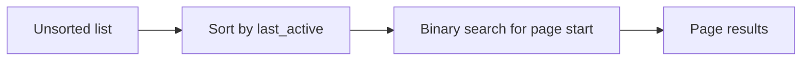

# Sorting and Searching

## Why it matters
Sorting and searching are core operations behind indexing, pagination, and
ranking.

## Progression checkpoints
| Level | Focus |
| --- | --- |
| Beginner | Use built-in sorting and linear search. |
| Intermediate | Understand binary search and stable sorts. |
| Senior | Choose algorithms based on data shape. |
| Principal | Set standards for ranking and ordering. |

## Key concepts
- Sorting algorithms: quicksort, mergesort, heapsort.
- Stability and in-place vs out-of-place sorting.
- Binary search and lower/upper bounds.
- Partial sorting for top-K.

## Real-world example: Recent users list
A dashboard lists users by last active time and uses binary search for paging.

## Diagram

## Practical checklist
- Prefer built-in sorts unless custom behavior is required.
- Use binary search on sorted data to avoid scans.
- Consider top-K algorithms for large datasets.
