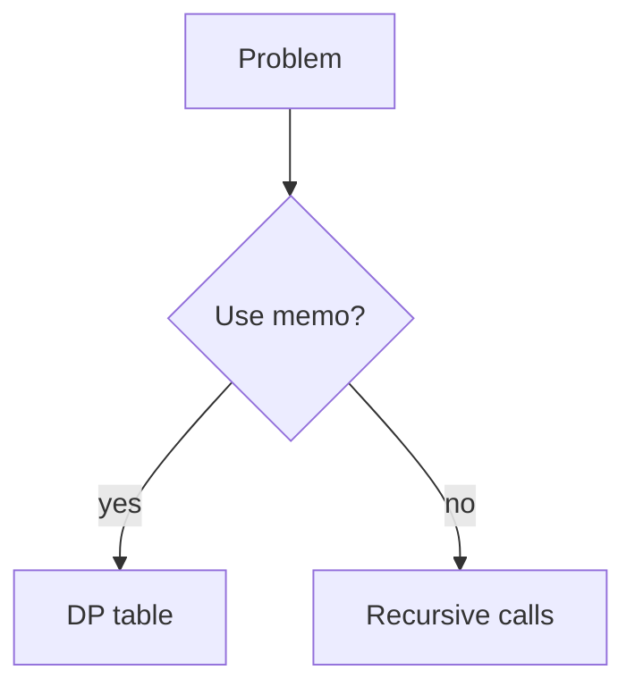

# Patterns: Recursion, DP, Greedy

## Why it matters
Many backend problems map to recurring algorithm patterns. Knowing them helps
you design correct, efficient solutions quickly.

## Progression checkpoints
| Level | Focus |
| --- | --- |
| Beginner | Understand recursion and base cases. |
| Intermediate | Use backtracking and divide-and-conquer. |
| Senior | Apply dynamic programming and greedy choices. |
| Principal | Choose the simplest correct pattern for production. |

## Key concepts
- Recursion and backtracking.
- Divide and conquer (merge, partition).
- Dynamic programming and memoization.
- Greedy algorithms and proof of optimality.

## Real-world example: Subscription bundling
Choose the cheapest combination of plans to cover a set of features using DP.

## Diagram

## Practical checklist
- Always define base cases for recursion.
- Use memoization to avoid repeated work.
- Prove greedy correctness before using it.
