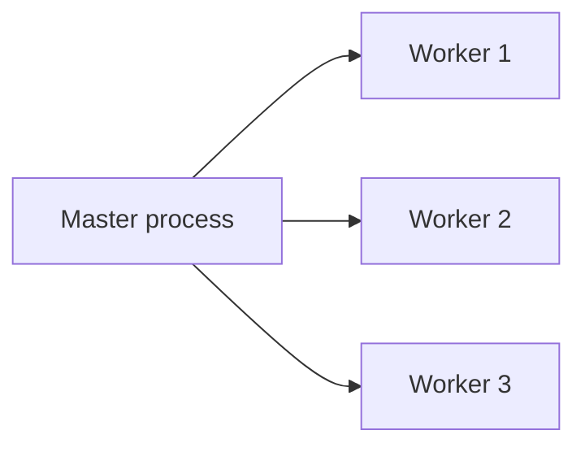

# Processes and Threads

## Why it matters
Concurrency models affect throughput, latency, and isolation. Understanding the
difference between processes and threads guides design choices.

## Progression checkpoints
| Level | Focus |
| --- | --- |
| Beginner | Understand processes vs threads. |
| Intermediate | Use thread pools and worker models. |
| Senior | Diagnose contention and context switching. |
| Principal | Choose concurrency models for services. |

## Key concepts
- Process isolation and memory space.
- Threads and shared memory.
- Scheduling and context switches.
- Worker pools and event loops.

## Detailed explanation
- **Processes** have separate address spaces, so faults are isolated but memory
  use is higher. IPC is required to share state.
- **Threads** share memory and are cheaper to create, but require synchronization
  to avoid data races and corruption.
- **Scheduling and context switching** introduce overhead. High thread counts
  can reduce throughput if they cause excessive context switches.
- **Concurrency models** (process pools, thread pools, event loops) trade
  isolation for efficiency depending on workload shape.

## Real-world example: Web server workers
A service uses multiple worker processes to isolate crashes and improve
throughput on multi-core machines.

## Diagram

## Additional real-world examples
- Background job system runs workers as separate processes so a crash does not
  take down the scheduler.
- CPU-bound analytics tasks use a thread pool sized to core count to avoid
  oversubscription.
- A chat server uses an event loop per process to handle many idle connections.

## Practical checklist
- Use processes for isolation when crashes are costly.
- Avoid shared mutable state across threads.
- Match worker count to CPU cores.

## Official documentation
- https://man7.org/linux/man-pages/man2/fork.2.html
- https://man7.org/linux/man-pages/man7/pthreads.7.html
- https://pubs.opengroup.org/onlinepubs/9699919799/functions/pthread_create.html
