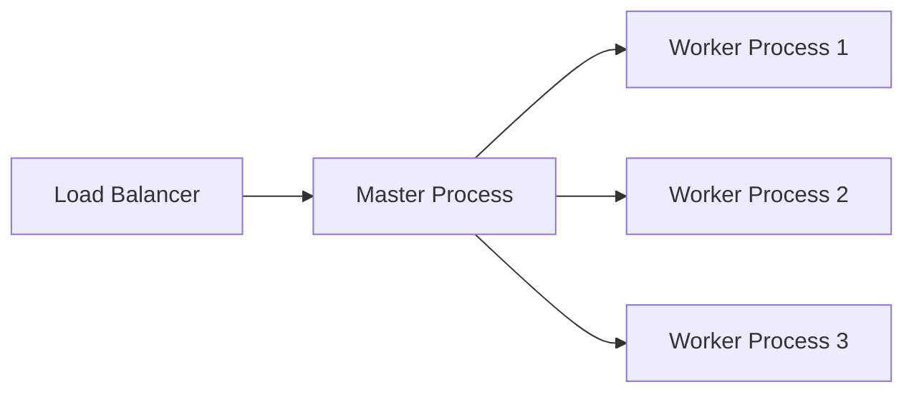

# Processes and Threads

## Why it matters (in 30 seconds)
When systems slow down or fail under load, the root cause is often **concurrency**:
- too many threads (context switching)
- shared memory bugs (race conditions)
- lack of isolation (one crash brings down everything)

Choosing **process vs thread** decides:
- throughput
- latency
- reliability
- debugging difficulty
- security isolation

---

## Progression checkpoints
| Level | What you should be able to do |
| --- | --- |
| Beginner | Explain process vs thread in 1 min with examples |
| Intermediate | Use thread pools, avoid blocking mistakes |
| Senior | Debug contention + performance regressions |
| Principal | Choose correct concurrency model for services and justify trade-offs |

---

## The 1-line definition (easy recall)
✅ **Process = isolation**  
✅ **Thread = sharing**

Everything else is a consequence.

---

## Core mental model: “What is shared?”
A process is like **two different houses** 🏠🏠  
A thread is like **two people inside the same house** 🏠👬

### Processes
- separate memory
- separate failure domain
- safer but heavier

### Threads
- shared memory
- shared failure domain
- faster but riskier

---

## Quick comparison (memorize this)
| Feature | Process | Thread |
| --- | --- | --- |
| Memory | Separate | Shared |
| Crash impact | One process dies | Whole process can die |
| Communication | IPC needed | Direct shared variables |
| Cost | Higher (heavier) | Lower (lighter) |
| Debugging | Easier | Harder (races) |
| Isolation/security | Strong | Weak |

---

## Key concepts (must know)
- **Address space**: virtual memory of a process
- **Stack**: each thread has its own stack
- **Scheduler**: OS decides what runs on CPU
- **Context switch**: switching execution from one thread/process to another
- **IPC**: inter-process communication (pipes, sockets, shared memory)

---

## Deep dive (in an easy way)

### 1) What is a Process?
A **process** is a running program with:
- its own **virtual memory**
- its own resources (files, handles, etc.)
- at least one thread inside it

#### Remember this:
> If one process corrupts memory, it cannot corrupt another process memory easily.

This is why **multi-process models are safer**.

---

### 2) What is a Thread?
A **thread** is an execution unit inside a process.

Each thread has:
- its own registers (PC, SP)
- its own stack

All threads share:
- heap memory
- global variables
- open files (usually)

#### Remember this:
> If thread A writes bad data, thread B may read it immediately.

So thread systems are **fast but dangerous**.

---

### 3) Context switching (why high threads reduce throughput)
Every time CPU switches between threads/processes:
- it saves old state
- loads new state
- caches become less useful

#### Easy rule:
✅ More threads != more performance  
✅ Too many threads = overhead dominates

Common symptom:
- CPU usage high
- throughput low
- latency spikes

This is called **oversubscription**.

---

### 4) Concurrency vs Parallelism (important)
- **Concurrency** = many tasks make progress
- **Parallelism** = many tasks execute simultaneously

Examples:
- Event loop can support concurrency (many connections)  
- But needs multiple loops/processes for parallelism

---

### 5) Sharing state: IPC vs Shared memory
Processes need IPC:
- pipes
- sockets
- message queues
- shared memory

Threads share memory directly:
- fastest communication
- highest bug risk

#### Memory trick:
✅ Process communication = “talking via phone” 📞  
✅ Thread communication = “talking in same room” 🗣️

---

## Concurrency models (principal engineer viewpoint)

### Model 1: Multi-process workers (safe)
Example: nginx, many gateways, job runners

- master spawns N processes
- each worker handles requests

✅ Pros:
- crash isolation
- stable under load

❌ Cons:
- more RAM
- IPC overhead

---

### Model 2: Thread-per-request (simple but risky)
Example: naive Java servlet model

✅ Pros:
- easy coding

❌ Cons:
- cannot scale well at huge concurrency
- thread explosion
- context switching overhead

---

### Model 3: Event loop (high scale IO)
Example: Node.js, Netty, WebFlux gateway

✅ Pros:
- handles 10k+ concurrent IO connections
- fewer threads

❌ Cons:
- if you block → everything slows down
- debugging requires discipline

---

### Model 4: Hybrid (most common in real life)
Example: modern high-performance services

- multiple processes
- each has event loop
- bounded thread pool for CPU work

This is a **best of both worlds** approach.

---

## Diagram: Multi-process workers

---

## Real-world examples (Git-friendly)

### Example 1: Nginx / Web server worker model (Multi-process)
**Context**
- High traffic web server (millions of requests/day)

**Problem**
- A single crash should not bring down the full server
- Must use multiple CPU cores efficiently

**Decision**
- Use multiple **worker processes**
- One master process manages lifecycle

**Why this works**
- Process isolation prevents one worker crash from affecting others
- Uses multi-core machines effectively

**Key takeaway**
- ✅ Use **process workers** when **availability + isolation** matters

---

### Example 2: Background job processing (Multi-process execution)
**Context**
- Job runner executes tasks like PDF generation, image processing, webhook retries

**Problem**
- Some jobs can leak memory or crash due to bad input
- One bad job must not kill the whole scheduler

**Decision**
- Execute each job (or job group) in a separate **process**
- Restart processes after N jobs (optional)

**Why this works**
- Strong fault isolation
- Easy recovery by restarting workers

**Key takeaway**
- ✅ Use **process isolation** when workload is unpredictable or untrusted

---

### Example 3: CPU-bound services (Thread pool sized by CPU cores)
**Context**
- Service performs crypto signing, compression, ML inference, report generation

**Problem**
- CPU-heavy operations must run in parallel without overload

**Decision**
- Use a **bounded thread pool**
- Size pool near `#CPU cores` (or `#CPU cores + small buffer`)

**Why this works**
- Avoids oversubscription and context switch explosion
- Predictable performance under load

**Key takeaway**
- ✅ CPU-bound work → threads ≈ cores

---

### Example 4: Spring WebFlux gateway (Event loop + bounded CPU pool)
**Context**
- Reactive API gateway built on Netty + WebFlux
- Needs to handle thousands of concurrent connections

**Problem**
- Blocking calls inside event-loop cause system-wide latency spikes

**Decision**
- Keep event loop for non-blocking IO only
- Offload blocking/CPU heavy work using bounded schedulers / pools

**Why this works**
- Event loop stays responsive
- CPU work does not starve IO threads

**Key takeaway**
- ✅ Reactive stack → **never block event loop**

---

### Example 5: Payment processing service (Hybrid: process + threads)
**Context**
- Payment service with strict uptime & latency requirements
- Needs both high throughput and protection against failures

**Problem**
- Thread-only model risks shared-failure domain
- Process-only model may waste memory/resources

**Decision**
- Run multiple **service instances/processes**
- Each instance uses:
  - event loop for network IO (if reactive)
  - bounded thread pool for CPU tasks

**Why this works**
- Multi-process provides blast-radius control
- Threads provide fast local parallelism

**Key takeaway**
- ✅ Most production systems end up **hybrid**
