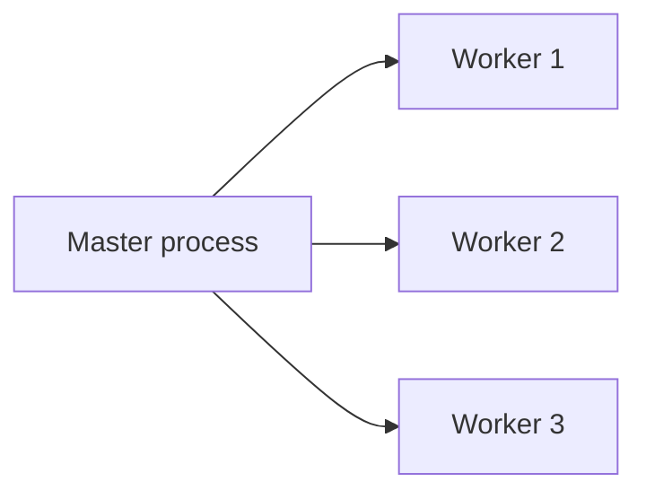

# Processes and Threads

## Why it matters
Concurrency models affect throughput, latency, and isolation. Understanding the
difference between processes and threads guides design choices.

## Progression checkpoints
| Level | Focus |
| --- | --- |
| Beginner | Understand processes vs threads. |
| Intermediate | Use thread pools and worker models. |
| Senior | Diagnose contention and context switching. |
| Principal | Choose concurrency models for services. |

## Key concepts
- Process isolation and memory space.
- Threads and shared memory.
- Scheduling and context switches.
- Worker pools and event loops.

## Real-world example: Web server workers
A service uses multiple worker processes to isolate crashes and improve
throughput on multi-core machines.

## Diagram

## Practical checklist
- Use processes for isolation when crashes are costly.
- Avoid shared mutable state across threads.
- Match worker count to CPU cores.
