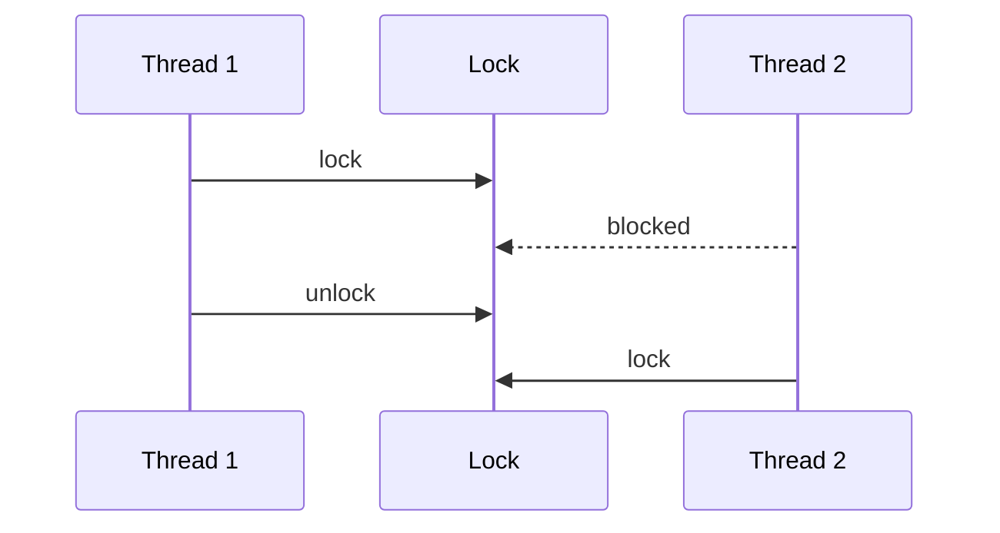

# Concurrency Primitives

## Why it matters
Concurrency errors are subtle and expensive. Correct use of primitives avoids
data races and deadlocks.

## Progression checkpoints
| Level | Focus |
| --- | --- |
| Beginner | Understand mutexes and locks. |
| Intermediate | Use semaphores and condition variables. |
| Senior | Prevent deadlocks and starvation. |
| Principal | Define concurrency guidelines for teams. |

## Key concepts
- Mutexes and read-write locks.
- Semaphores and condition variables.
- Deadlocks, livelocks, and starvation.
- Atomic operations.

## Real-world example: In-memory counter
A rate limiter increments counters safely across threads using a mutex.

## Diagram

## Practical checklist
- Keep lock scopes small.
- Avoid nested locks with conflicting order.
- Prefer lock-free structures when possible.
