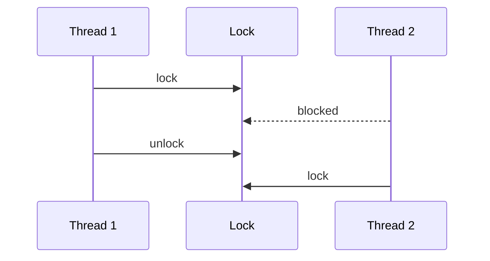

# Concurrency Primitives

## Why it matters
Concurrency errors are subtle and expensive. Correct use of primitives avoids
data races and deadlocks.

## Progression checkpoints
| Level | Focus |
| --- | --- |
| Beginner | Understand mutexes and locks. |
| Intermediate | Use semaphores and condition variables. |
| Senior | Prevent deadlocks and starvation. |
| Principal | Define concurrency guidelines for teams. |

## Key concepts
- Mutexes and read-write locks.
- Semaphores and condition variables.
- Deadlocks, livelocks, and starvation.
- Atomic operations.

## Detailed explanation
- **Mutexes** provide exclusive access to critical sections, while **RW locks**
  allow multiple readers but only one writer, improving read-heavy workloads.
- **Semaphores** limit concurrent access to a resource pool (connections,
  workers). **Condition variables** coordinate state changes between threads.
- **Deadlocks** occur when locks are acquired in inconsistent order. Establish
  lock ordering rules and keep critical sections small.
- **Atomics** enable lock-free counters and flags, but require care to avoid
  subtle memory ordering bugs.

## Real-world example: In-memory counter
A rate limiter increments counters safely across threads using a mutex.

## Diagram

## Additional real-world examples
- Semaphore limits the number of concurrent DB connections in a worker pool.
- Producer/consumer queue uses a condition variable to wake workers on new work.
- Atomic counters track in-flight requests without a global lock.

## Practical checklist
- Keep lock scopes small.
- Avoid nested locks with conflicting order.
- Prefer lock-free structures when possible.

## Official documentation
- https://man7.org/linux/man-pages/man3/pthread_mutex_lock.3p.html
- https://man7.org/linux/man-pages/man3/pthread_cond_wait.3p.html
- https://man7.org/linux/man-pages/man3/sem_init.3.html
- https://man7.org/linux/man-pages/man7/futex.7.html
