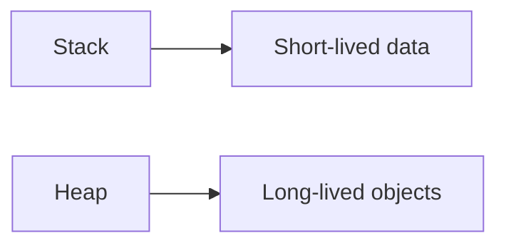

# Memory Management

## Why it matters
Memory issues cause slowdowns and crashes. Understanding memory helps you
avoid leaks and optimize performance.

## Progression checkpoints
| Level | Focus |
| --- | --- |
| Beginner | Stack vs heap basics. |
| Intermediate | Understand garbage collection or manual memory. |
| Senior | Diagnose leaks and optimize allocations. |
| Principal | Set memory budgets and limits. |

## Key concepts
- Stack vs heap allocation.
- Virtual memory and paging.
- Garbage collection and tuning.
- Memory fragmentation and leaks.

## Real-world example: Cache growth
A cache grows without eviction, leading to OOM kills. The team adds LRU
eviction and memory limits.

## Diagram

## Practical checklist
- Profile allocations and track memory growth.
- Set limits for caches and in-memory data.
- Monitor GC pauses and tuning metrics.
