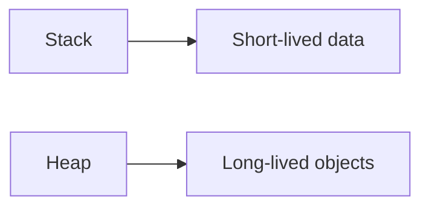

# Memory Management

## Why it matters
Memory issues cause slowdowns and crashes. Understanding memory helps you
avoid leaks and optimize performance.

## Progression checkpoints
| Level | Focus |
| --- | --- |
| Beginner | Stack vs heap basics. |
| Intermediate | Understand garbage collection or manual memory. |
| Senior | Diagnose leaks and optimize allocations. |
| Principal | Set memory budgets and limits. |

## Key concepts
- Stack vs heap allocation.
- Virtual memory and paging.
- Garbage collection and tuning.
- Memory fragmentation and leaks.

## Detailed explanation
- **Stack allocation** is fast and scoped to function calls. **Heap allocation**
  supports dynamic lifetimes but needs GC or manual free.
- **Virtual memory** allows processes to use large address spaces while the OS
  pages data in and out. Page faults can cause latency spikes.
- **Garbage collectors** trade throughput for pause time. Tune GC thresholds
  when latency is sensitive.
- **Fragmentation** increases memory overhead. Long-lived allocations mixed with
  short-lived objects can cause inefficient use of RAM.

## Real-world example: Cache growth
A cache grows without eviction, leading to OOM kills. The team adds LRU
eviction and memory limits.

## Diagram

## Additional real-world examples
- Image processing job spikes memory due to large buffers; streaming reduces
  peak usage.
- Microservice leak traced to a global map that never evicts entries.
- GC pauses increase after a feature adds large object allocations per request.

## Practical checklist
- Profile allocations and track memory growth.
- Set limits for caches and in-memory data.
- Monitor GC pauses and tuning metrics.

## Official documentation
- https://man7.org/linux/man-pages/man5/proc.5.html
- https://go.dev/doc/gc
- https://docs.oracle.com/en/java/javase/17/gctuning/
