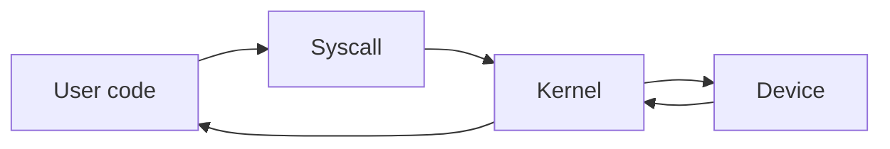

# System Calls and Kernel

## Why it matters
System calls bridge your code and the OS. Knowing their cost helps you design
efficient services.

## Progression checkpoints
| Level | Focus |
| --- | --- |
| Beginner | Know what syscalls are. |
| Intermediate | Understand user vs kernel space. |
| Senior | Reduce syscall overhead in hot paths. |
| Principal | Choose runtimes with predictable syscall behavior. |

## Key concepts
- User space vs kernel space.
- Common syscalls: read, write, open, accept.
- Context switching overhead.
- Signals and process control.

## Detailed explanation
- **User vs kernel space** separates application memory from privileged kernel
  memory. Syscalls cross this boundary and incur overhead.
- **Syscall overhead** adds up in tight loops. Batching I/O or using async
  primitives reduces the number of boundary crossings.
- **Signals** deliver asynchronous events (timeouts, termination). Handle them
  carefully to avoid leaving resources in inconsistent states.
- **Process control** syscalls (fork, exec, wait) influence isolation and
  startup time for worker processes.

## Real-world example: High-throughput server
A server uses fewer syscalls by batching reads and using non-blocking sockets.

## Diagram

## Additional real-world examples
- File-serving service uses `sendfile` to avoid extra user-space copies.
- Job runner preallocates output files to reduce fragmentation and retries.
- Server uses `accept4` with non-blocking sockets to avoid extra `fcntl` calls.

## Practical checklist
- Avoid per-request syscalls when possible.
- Use buffered I/O to reduce overhead.
- Measure syscall rates for hot services.

## Official documentation
- https://man7.org/linux/man-pages/man2/read.2.html
- https://man7.org/linux/man-pages/man2/write.2.html
- https://man7.org/linux/man-pages/man2/accept.2.html
- https://man7.org/linux/man-pages/man2/sendfile.2.html
