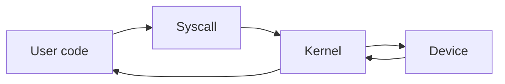

# System Calls and Kernel

## Why it matters
System calls bridge your code and the OS. Knowing their cost helps you design
efficient services.

## Progression checkpoints
| Level | Focus |
| --- | --- |
| Beginner | Know what syscalls are. |
| Intermediate | Understand user vs kernel space. |
| Senior | Reduce syscall overhead in hot paths. |
| Principal | Choose runtimes with predictable syscall behavior. |

## Key concepts
- User space vs kernel space.
- Common syscalls: read, write, open, accept.
- Context switching overhead.
- Signals and process control.

## Real-world example: High-throughput server
A server uses fewer syscalls by batching reads and using non-blocking sockets.

## Diagram

## Practical checklist
- Avoid per-request syscalls when possible.
- Use buffered I/O to reduce overhead.
- Measure syscall rates for hot services.
