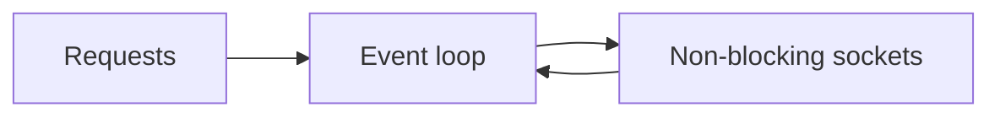

# I/O Models and Async

## Why it matters
I/O models determine how well a service handles many concurrent connections.

## Progression checkpoints
| Level | Focus |
| --- | --- |
| Beginner | Know blocking vs non-blocking I/O. |
| Intermediate | Use async event loops correctly. |
| Senior | Tune event loop and thread pools. |
| Principal | Set I/O strategy for large-scale services. |

## Key concepts
- Blocking, non-blocking, and async I/O.
- Event loops and reactor pattern.
- Thread pools vs async tasks.
- Backpressure and queue limits.

## Real-world example: Chat gateway
A chat gateway uses async sockets to handle tens of thousands of connections.

## Diagram

## Practical checklist
- Avoid blocking calls inside async handlers.
- Set limits for queues and concurrent tasks.
- Measure event loop lag.
