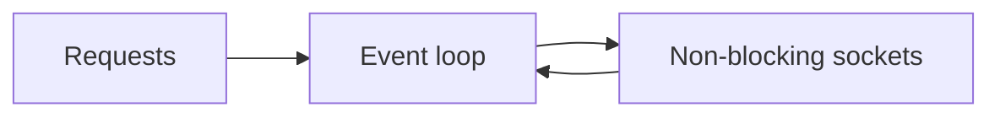

# I/O Models and Async

## Why it matters
I/O models determine how well a service handles many concurrent connections.

## Progression checkpoints
| Level | Focus |
| --- | --- |
| Beginner | Know blocking vs non-blocking I/O. |
| Intermediate | Use async event loops correctly. |
| Senior | Tune event loop and thread pools. |
| Principal | Set I/O strategy for large-scale services. |

## Key concepts
- Blocking, non-blocking, and async I/O.
- Event loops and reactor pattern.
- Thread pools vs async tasks.
- Backpressure and queue limits.

## Detailed explanation
- **Blocking I/O** ties up threads while waiting on the OS, which limits
  concurrency when requests are mostly idle.
- **Non-blocking + event loop** lets one thread manage many sockets, waking only
  when I/O is ready.
- **Thread pools** are best for CPU-bound tasks; async tasks are best for
  high-latency I/O workloads.
- **Backpressure** protects the system from overload by bounding queues and
  rejecting or shedding work when limits are reached.

## Real-world example: Chat gateway
A chat gateway uses async sockets to handle tens of thousands of connections.

## Diagram

## Additional real-world examples
- API gateway measures event loop lag and autoscale when lag exceeds a threshold.
- Media transcoding uses a thread pool for CPU-bound work and async I/O for
  uploads/downloads.
- Streaming service enforces per-connection buffers to avoid unbounded memory.

## Practical checklist
- Avoid blocking calls inside async handlers.
- Set limits for queues and concurrent tasks.
- Measure event loop lag.

## Official documentation
- https://man7.org/linux/man-pages/man7/epoll.7.html
- https://docs.python.org/3/library/asyncio.html
- https://nodejs.org/en/docs/guides/event-loop-timers-and-nexttick/
- https://docs.oracle.com/javase/8/docs/api/java/nio/package-summary.html
