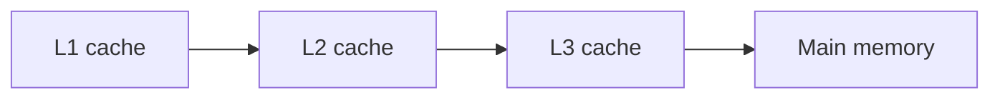

# CPU Caches and Performance

## Why it matters
CPU caches dominate performance for many workloads. Cache misses cause latency
spikes and reduce throughput.

## Progression checkpoints
| Level | Focus |
| --- | --- |
| Beginner | Understand cache hierarchy. |
| Intermediate | Optimize data locality. |
| Senior | Reduce cache misses in hot paths. |
| Principal | Set performance budgets and profiling standards. |

## Key concepts
- L1, L2, L3 cache hierarchy.
- Cache lines and locality.
- False sharing and contention.
- Context switching costs.

## Detailed explanation
- **Cache lines** (often 64 bytes) are the unit of transfer. Accessing adjacent
  data is faster than scattered memory.
- **Locality** (spatial and temporal) improves hit rates. Tight loops over
  contiguous arrays outperform pointer-heavy structures.
- **False sharing** occurs when threads update different variables that share
  a cache line, causing unnecessary invalidation.
- **Context switching** can evict hot data from caches, increasing latency.

## Real-world example: Metrics aggregation
A metrics service groups counters by key. Sorting keys improves locality and
reduces cache misses.

## Diagram

## Additional real-world examples
- Sharded counters reduce contention and false sharing in multi-threaded stats.
- Switching from map-heavy lookups to arrays speeds up hot-path routing.
- Batch processing keeps working sets in L2/L3 for better throughput.

## Practical checklist
- Keep hot data structures compact.
- Avoid false sharing across threads.
- Profile before optimizing.

## Official documentation
- https://www.intel.com/content/www/us/en/developer/articles/technical/intel-sdm.html
- https://developer.arm.com/documentation/den0013/latest
- https://man7.org/linux/man-pages/man1/perf.1.html
