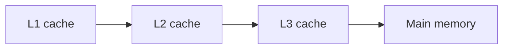

# CPU Caches and Performance

## Why it matters
CPU caches dominate performance for many workloads. Cache misses cause latency
spikes and reduce throughput.

## Progression checkpoints
| Level | Focus |
| --- | --- |
| Beginner | Understand cache hierarchy. |
| Intermediate | Optimize data locality. |
| Senior | Reduce cache misses in hot paths. |
| Principal | Set performance budgets and profiling standards. |

## Key concepts
- L1, L2, L3 cache hierarchy.
- Cache lines and locality.
- False sharing and contention.
- Context switching costs.

## Real-world example: Metrics aggregation
A metrics service groups counters by key. Sorting keys improves locality and
reduces cache misses.

## Diagram

## Practical checklist
- Keep hot data structures compact.
- Avoid false sharing across threads.
- Profile before optimizing.
