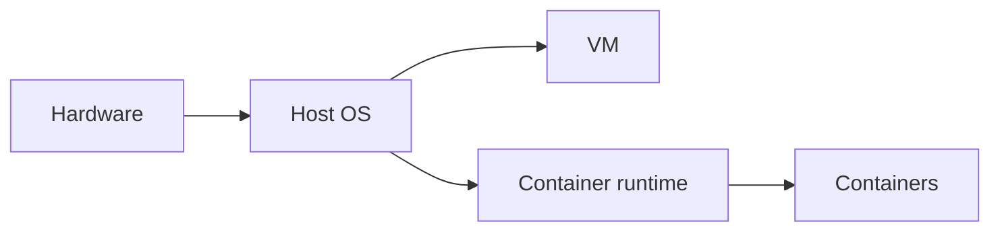

# Containers and Virtualization

## Why it matters
Containers and VMs define how services run and scale. Understanding isolation
helps you avoid noisy neighbors and resource contention.

## Progression checkpoints
| Level | Focus |
| --- | --- |
| Beginner | Understand containers vs VMs. |
| Intermediate | Use cgroups and namespaces. |
| Senior | Tune resource limits and startup behavior. |
| Principal | Define runtime standards and policies. |

## Key concepts
- Virtual machines vs containers.
- Namespaces, cgroups, and isolation.
- Image layers and startup time.
- Resource limits and throttling.

## Real-world example: Batch jobs
Batch jobs run in containers with CPU and memory limits to avoid impacting
customer-facing services.

## Diagram

## Practical checklist
- Set CPU and memory limits for all workloads.
- Monitor throttling and OOM kills.
- Keep images small for faster startup.
