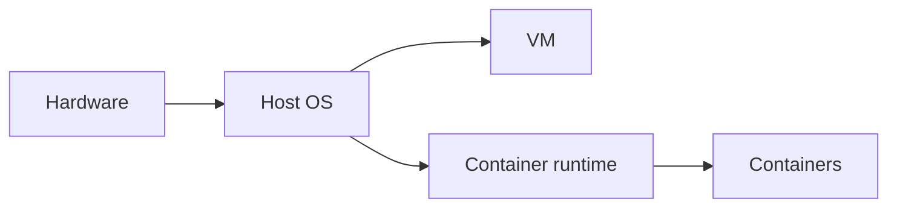

# Containers and Virtualization

## Why it matters
Containers and VMs define how services run and scale. Understanding isolation
helps you avoid noisy neighbors and resource contention.

## Progression checkpoints
| Level | Focus |
| --- | --- |
| Beginner | Understand containers vs VMs. |
| Intermediate | Use cgroups and namespaces. |
| Senior | Tune resource limits and startup behavior. |
| Principal | Define runtime standards and policies. |

## Key concepts
- Virtual machines vs containers.
- Namespaces, cgroups, and isolation.
- Image layers and startup time.
- Resource limits and throttling.

## Detailed explanation
- **VMs** provide full OS isolation with higher overhead, while **containers**
  share the host kernel and start faster.
- **Namespaces** isolate process IDs, networking, and filesystems. **cgroups**
  enforce CPU, memory, and I/O limits.
- **Image layering** affects pull size and startup time. Fewer layers and
  smaller bases improve cold starts.
- **Throttling** protects shared hosts but can introduce latency spikes if
  limits are too low.

## Real-world example: Batch jobs
Batch jobs run in containers with CPU and memory limits to avoid impacting
customer-facing services.

## Diagram

## Additional real-world examples
- Latency-sensitive service requests a guaranteed CPU limit to avoid throttling.
- Build pipeline uses slim base images to reduce deployment times.
- Multi-tenant platform uses cgroup limits to prevent noisy neighbor issues.

## Practical checklist
- Set CPU and memory limits for all workloads.
- Monitor throttling and OOM kills.
- Keep images small for faster startup.

## Official documentation
- https://man7.org/linux/man-pages/man7/namespaces.7.html
- https://www.kernel.org/doc/html/latest/admin-guide/cgroup-v2.html
- https://docs.docker.com/get-started/
