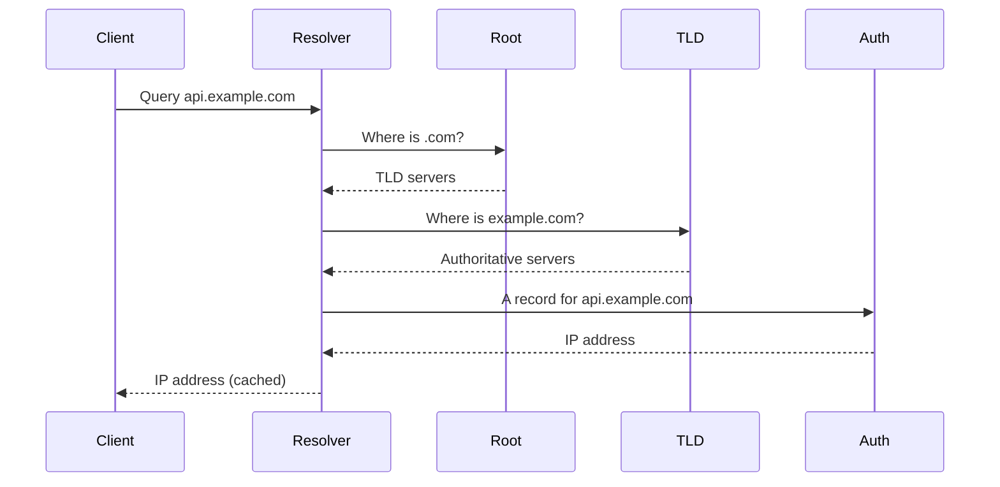

# DNS and Domain Resolution

## Why it matters
DNS is the phonebook of the internet. Slow or incorrect DNS can break your
service even when your backend is healthy.

## Progression checkpoints
| Level | Focus |
| --- | --- |
| Beginner | Understand DNS records and resolution flow. |
| Intermediate | Use TTLs and caching effectively. |
| Senior | Plan safe DNS cutovers and failover. |
| Principal | Define global routing and DNS governance. |

## Key concepts
- Resolver types: stub, recursive, authoritative.
- Records: A, AAAA, CNAME, TXT, NS, SRV.
- TTLs, caching, and negative caching (NXDOMAIN).
- Split-horizon DNS and geo routing.

## Real-world example: API domain cutover
An API moves from one load balancer to another. A low TTL is set days ahead,
but some resolvers ignore it, causing partial traffic split for hours.

## Diagram

## Practical checklist
- Lower TTL before cutovers and restore afterward.
- Use health checks with DNS failover when possible.
- Document who owns records and update workflows.
