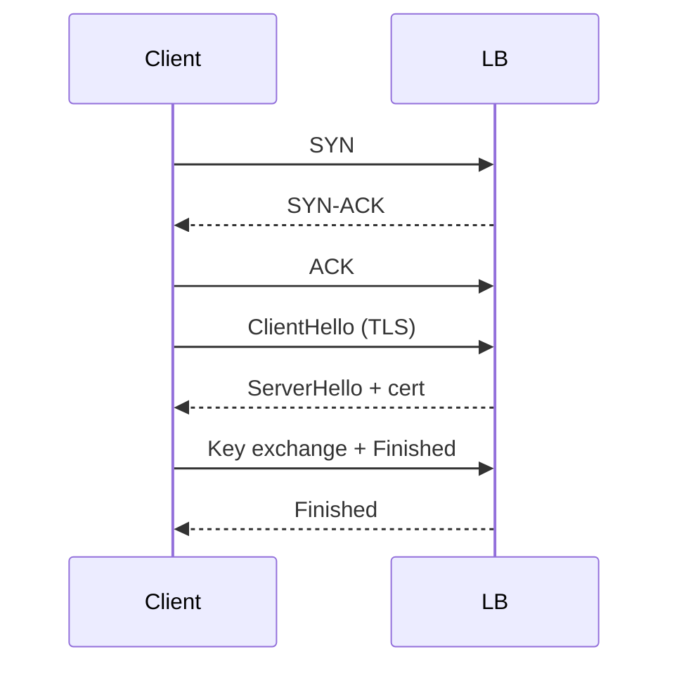

# TCP, UDP, and TLS

## Why it matters
Choosing the right transport and securing it properly affects reliability,
latency, and user trust.

## Progression checkpoints
| Level | Focus |
| --- | --- |
| Beginner | Know the difference between TCP and UDP. |
| Intermediate | Understand handshakes and retransmits. |
| Senior | Diagnose congestion and handshake failures. |
| Principal | Define TLS and mTLS standards across services. |

## Key concepts
- TCP reliability, congestion control, and flow control.
- UDP use cases: real-time media and telemetry.
- TLS handshake, certificates, and ALPN.
- mTLS for service-to-service authentication.

## Detailed explanation
- **TCP** provides ordered, reliable delivery with congestion control, which
  protects the network but can add latency during slow start.
- **UDP** avoids connection setup and retransmits, which suits real-time media
  where late packets are less useful than lost packets.
- **TLS handshakes** add round trips. Session resumption and HTTP/2/3 reduce
  repeated handshakes for frequent connections.
- **mTLS** verifies both client and server, strengthening internal service
  authentication and reducing lateral movement risk.

## Real-world example: Payment API security
A payment API terminates TLS at the load balancer and uses mTLS for calls to
internal services to prevent lateral movement.

## Diagram

## Additional real-world examples
- Telemetry pipeline uses UDP for metrics to minimize overhead and tolerate loss.
- Mobile app enables TLS session resumption to reduce handshake latency.
- Internal service mesh requires mTLS for all east-west traffic.

## Practical checklist
- Enforce TLS 1.2+ and rotate certificates regularly.
- Use timeouts for connect and handshake operations.
- Prefer TCP for ordered, reliable data; UDP for low latency.

## Official documentation
- https://www.rfc-editor.org/rfc/rfc9293
- https://www.rfc-editor.org/rfc/rfc768
- https://www.rfc-editor.org/rfc/rfc8446
