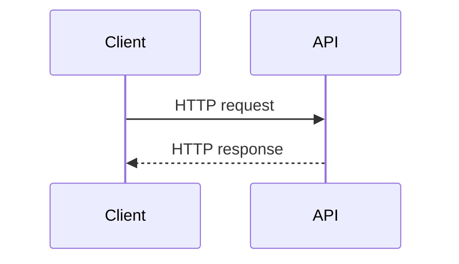

# HTTP Core Concepts

## Why it matters
HTTP is the default protocol for modern APIs. Correct use of methods, status
codes, and headers keeps APIs predictable and scalable.

## Progression checkpoints
| Level | Focus |
| --- | --- |
| Beginner | Understand methods, status codes, and headers. |
| Intermediate | Use cookies, content negotiation, and idempotency. |
| Senior | Define API conventions and compatibility rules. |
| Principal | Standardize HTTP semantics across services. |

## Key concepts
- Methods: GET, POST, PUT, PATCH, DELETE, OPTIONS.
- Status codes: 2xx, 3xx, 4xx, 5xx.
- Headers: Authorization, Content-Type, Cache-Control.
- Cookies and sessions; idempotency keys.

## Real-world example: Resumable file upload
A media service accepts large uploads using PUT and Content-Range headers.

```http
PUT /uploads/123 HTTP/1.1
Content-Range: bytes 0-999999/5000000
Content-Type: application/octet-stream
Idempotency-Key: 8f8c2d2c-9f6b-4b8b-9e6c-9b2e2f3c4b5a
```

## Diagram


## Practical checklist
- Use idempotency keys for retryable writes.
- Return consistent error formats and status codes.
- Avoid mixing business errors with 5xx responses.
