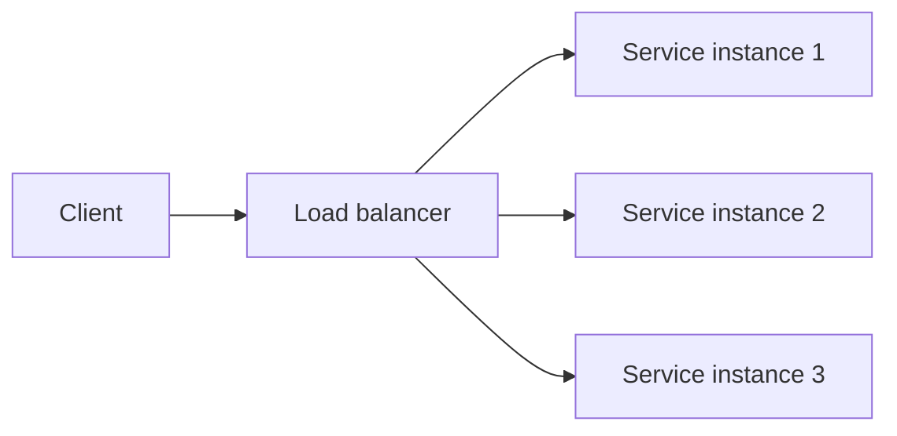

# Load Balancing and Proxies

## Why it matters
Load balancers and proxies keep services available under load and during
deployments. They also control TLS and routing policy.

## Progression checkpoints
| Level | Focus |
| --- | --- |
| Beginner | Know what a load balancer does. |
| Intermediate | Configure health checks and routing rules. |
| Senior | Choose L4 vs L7 and manage connection draining. |
| Principal | Define global routing and resilience policies. |

## Key concepts
- L4 vs L7 load balancing.
- Reverse proxies and API gateways.
- Health checks and circuit breaking.
- Connection draining and sticky sessions.

## Real-world example: Rolling deploy
During a deploy, the load balancer routes only to healthy instances and
drains connections before terminating old nodes.

## Diagram

## Practical checklist
- Use active health checks and remove unhealthy nodes quickly.
- Prefer stateless services to avoid sticky sessions.
- Ensure TLS termination and client IP forwarding are consistent.
