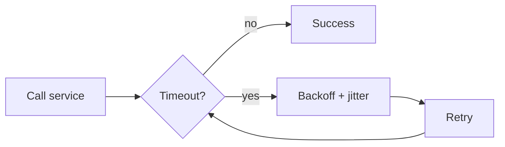

# Retries, Timeouts, and Backoff

## Why it matters
Retries can rescue transient failures, but they also amplify outages if
misconfigured. Timeouts define the upper bound of user latency.

## Progression checkpoints
| Level | Focus |
| --- | --- |
| Beginner | Set basic request timeouts. |
| Intermediate | Apply exponential backoff with jitter. |
| Senior | Use retry budgets and idempotency keys. |
| Principal | Standardize resilience policies across teams. |

## Key concepts
- Connect, read, and overall timeouts.
- Exponential backoff and jitter.
- Retry budgets and circuit breakers.
- Idempotency and safe retries.

## Real-world example: Checkout inventory call
A checkout service calls inventory with a 200 ms timeout and 2 retries with
jitter. Idempotency keys prevent double reservations.

## Diagram

## Practical checklist
- Keep retry counts low and cap total time spent.
- Apply jitter to avoid synchronized retry storms.
- Require idempotency keys for retried writes.
