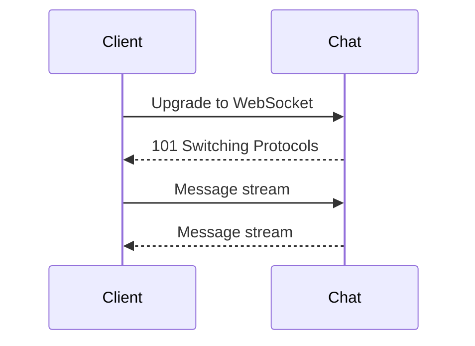

# API Protocols and Streaming

## Why it matters
Different protocols have different tradeoffs. The right choice improves
latency, bandwidth efficiency, and developer experience.

## Progression checkpoints
| Level | Focus |
| --- | --- |
| Beginner | Understand REST and request-response patterns. |
| Intermediate | Use gRPC or streaming when needed. |
| Senior | Design contracts for backward compatibility. |
| Principal | Define protocol standards across services. |

## Key concepts
- REST vs RPC and gRPC (HTTP/2).
- WebSockets, Server-Sent Events (SSE).
- Streaming and backpressure.
- Payload formats and schema evolution.

## Real-world example: Live chat
A chat system uses WebSockets for real-time updates and falls back to SSE for
restricted environments.

## Diagram

## Practical checklist
- Use gRPC for internal service-to-service APIs.
- Prefer WebSockets for bidirectional real-time updates.
- Document protocol choices and compatibility rules.
