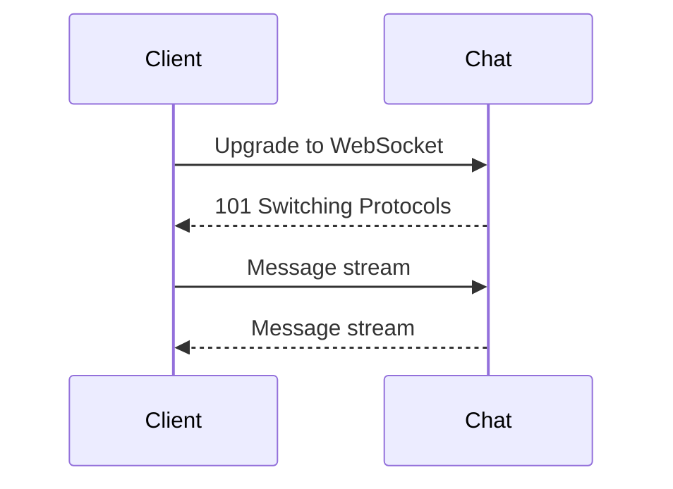

# API Protocols and Streaming

## Why it matters
Different protocols have different tradeoffs. The right choice improves
latency, bandwidth efficiency, and developer experience.

## Progression checkpoints
| Level | Focus |
| --- | --- |
| Beginner | Understand REST and request-response patterns. |
| Intermediate | Use gRPC or streaming when needed. |
| Senior | Design contracts for backward compatibility. |
| Principal | Define protocol standards across services. |

## Key concepts
- REST vs RPC and gRPC (HTTP/2).
- WebSockets, Server-Sent Events (SSE).
- Streaming and backpressure.
- Payload formats and schema evolution.

## Detailed explanation
- **REST** favors resource-based design and cache-friendly semantics; **RPC**
  favors explicit method calls and strongly typed contracts.
- **gRPC** runs over HTTP/2 and supports streaming with low overhead, making it
  strong for internal services.
- **WebSockets** provide bidirectional streams; **SSE** provides one-way server
  pushes over standard HTTP.
- **Schema evolution** requires backward-compatible changes and versioned
  contracts for long-lived clients.

## Real-world example: Live chat
A chat system uses WebSockets for real-time updates and falls back to SSE for
restricted environments.

## Diagram

## Additional real-world examples
- Mobile app uses REST for standard CRUD but gRPC streaming for sync updates.
- Analytics pipeline streams events via HTTP/2 with backpressure controls.
- SSE used for live dashboard updates behind enterprise proxies.

## Practical checklist
- Use gRPC for internal service-to-service APIs.
- Prefer WebSockets for bidirectional real-time updates.
- Document protocol choices and compatibility rules.

## Official documentation
- https://www.rfc-editor.org/rfc/rfc9113
- https://www.rfc-editor.org/rfc/rfc6455
- https://www.w3.org/TR/eventsource/
- https://grpc.io/docs/
