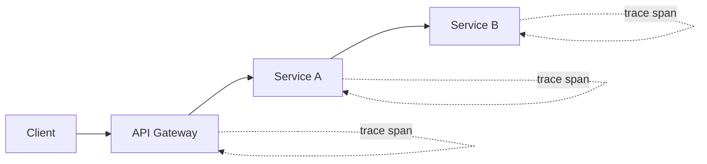

# Observability and Network Debugging

## Why it matters
Network issues often appear as latency spikes and intermittent failures.
Observability makes these issues diagnosable and repeatable.

## Progression checkpoints
| Level | Focus |
| --- | --- |
| Beginner | Collect logs, metrics, and traces. |
| Intermediate | Correlate requests across services. |
| Senior | Use tracing to pinpoint slow hops. |
| Principal | Define observability standards and SLIs. |

## Key concepts
- Distributed tracing and correlation IDs.
- Metrics: latency, error rate, throughput.
- Structured logs and request context.
- Synthetic checks and network probes.

## Detailed explanation
- **Distributed tracing** captures end-to-end latency and identifies slow hops.
- **Metrics** provide aggregated views for SLIs and alerting; they answer
  "how bad" and "how often."
- **Structured logs** include fields like request ID, region, and status to
  enable filtering during incidents.
- **Synthetic checks** validate DNS, TLS, and route health outside normal
  traffic patterns.

## Real-world example: API gateway latency regression
A new proxy rule increases latency. Traces show the delay at the gateway,
and a config rollback restores performance.

## Diagram

## Additional real-world examples
- Synthetic pings catch a DNS issue before customers report outages.
- Trace sampling is increased during an incident to capture more detail.
- Network probes show packet loss spikes on a single AZ link.

## Practical checklist
- Propagate trace IDs across every hop.
- Alert on p95 and p99 latency at the edge.
- Keep request logs structured and searchable.

## Official documentation
- https://opentelemetry.io/docs/
- https://www.w3.org/TR/trace-context/
