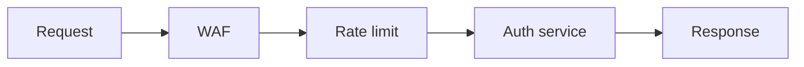

# Security and DDoS Basics

## Why it matters
Public APIs face constant abuse. Secure defaults and layered defenses protect
availability and user data.

## Progression checkpoints
| Level | Focus |
| --- | --- |
| Beginner | Use TLS and basic rate limiting. |
| Intermediate | Apply WAF rules and IP allowlists. |
| Senior | Model threat scenarios and attack surfaces. |
| Principal | Define security baselines and response playbooks. |

## Key concepts
- TLS, HSTS, and secure headers.
- WAF, rate limiting, and bot mitigation.
- DDoS types: volumetric, protocol, and application-layer.
- IP allowlists and geo blocking.

## Detailed explanation
- **TLS and HSTS** ensure encryption in transit and prevent protocol downgrades.
- **WAF rules** block common attack patterns; rate limits protect against abuse
  and credential stuffing.
- **DDoS layers** require different defenses: volumetric attacks need capacity,
  while app-layer attacks need filtering and caching.
- **Allowlists and geo rules** should be used sparingly to avoid blocking
  legitimate traffic.

## Real-world example: Login bot attack
A login endpoint receives a bot flood. The team enables WAF rules, adds a
captcha step, and applies a per-IP rate limit to stabilize the service.

## Diagram

## Additional real-world examples
- Admin endpoints restricted to a VPN allowlist to reduce exposure.
- CDN absorbs volumetric traffic while origin rate limits protect the backend.
- HSTS preload enabled to ensure browsers always use HTTPS.

## Practical checklist
- Enforce TLS and redirect HTTP to HTTPS.
- Set rate limits per IP and per user.
- Maintain an incident runbook for DDoS events.

## Official documentation
- https://www.rfc-editor.org/rfc/rfc6797
- https://www.rfc-editor.org/rfc/rfc8446
