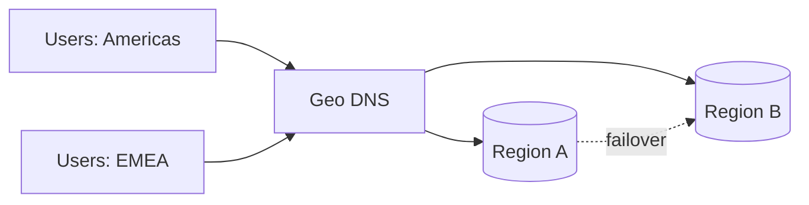

# Global Architecture and Edge Strategy

## Why it matters
Global users expect low latency and high availability. Multi-region design
reduces risk but adds complexity in routing and data consistency.

## Progression checkpoints
| Level | Focus |
| --- | --- |
| Beginner | Understand regions and basic failover. |
| Intermediate | Use geo routing and health checks. |
| Senior | Design active-active or active-passive architectures. |
| Principal | Define global standards and data residency policies. |

## Key concepts
- Geo DNS and latency-based routing.
- Anycast vs unicast IPs.
- Active-active vs active-passive strategies.
- Data residency and regulatory constraints.

## Real-world example: Global SaaS failover
Traffic is routed to the nearest region. During a regional outage, DNS and
health checks shift traffic to a standby region within minutes.

## Diagram

## Practical checklist
- Define failover thresholds and run drills.
- Maintain region-level capacity buffers.
- Document data residency requirements by region.
