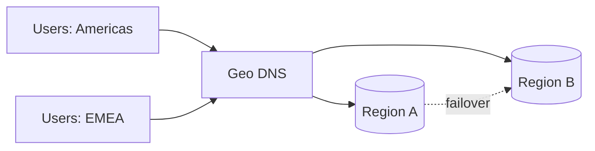

# Global Architecture and Edge Strategy

## Why it matters
Global users expect low latency and high availability. Multi-region design
reduces risk but adds complexity in routing and data consistency.

## Progression checkpoints
| Level | Focus |
| --- | --- |
| Beginner | Understand regions and basic failover. |
| Intermediate | Use geo routing and health checks. |
| Senior | Design active-active or active-passive architectures. |
| Principal | Define global standards and data residency policies. |

## Key concepts
- Geo DNS and latency-based routing.
- Anycast vs unicast IPs.
- Active-active vs active-passive strategies.
- Data residency and regulatory constraints.

## Detailed explanation
- **Geo routing** reduces latency but adds complexity for failover and cache
  invalidation across regions.
- **Anycast** can route users to the nearest edge automatically, but debugging
  routing decisions can be harder than unicast.
- **Active-active** improves availability but requires conflict resolution;
  **active-passive** simplifies data consistency at the cost of failover time.
- **Data residency** requirements can restrict where data is stored and
  processed, impacting architecture choices.

## Real-world example: Global SaaS failover
Traffic is routed to the nearest region. During a regional outage, DNS and
health checks shift traffic to a standby region within minutes.

## Diagram

## Additional real-world examples
- Active-active read traffic with region-local caches to keep latency low.
- Edge caching for static assets reduces cross-region bandwidth costs.
- EU user data stored in EU-only regions to meet residency requirements.

## Practical checklist
- Define failover thresholds and run drills.
- Maintain region-level capacity buffers.
- Document data residency requirements by region.

## Official documentation
- https://www.rfc-editor.org/rfc/rfc4786
- https://docs.aws.amazon.com/Route53/latest/DeveloperGuide/routing-policy.html
- https://cloud.google.com/load-balancing/docs/overview
