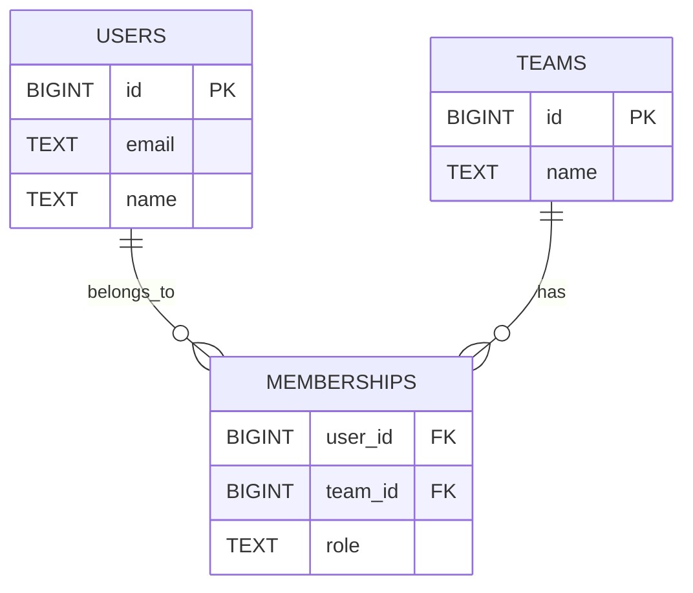

# Fundamentals

## Why it matters
Databases are the system of record. Solid fundamentals help you model data
cleanly, query it correctly, and avoid brittle schemas.

## Progression checkpoints
| Level | Focus |
| --- | --- |
| Beginner | Basic SQL, tables, keys, and simple joins. |
| Intermediate | Model relationships and enforce constraints. |
| Senior | Choose relational vs NoSQL based on access patterns. |
| Principal | Define data ownership and shared vocabulary. |

## Key concepts
- Relational vs NoSQL and common tradeoffs.
- Tables, rows, columns, primary keys, foreign keys.
- SQL CRUD: SELECT, INSERT, UPDATE, DELETE.
- Joins, GROUP BY, HAVING, aggregates.

## Detailed explanation
- **Relational databases** enforce schema and constraints, which protects data
  integrity; **NoSQL** often trades strict schema for flexible scaling.
- **Primary keys** uniquely identify rows; **foreign keys** enforce references
  and keep relationships consistent.
- **CRUD operations** are the base for all data access patterns; consistent
  naming and indexing make them predictable.
- **Aggregations** with GROUP BY power analytics and dashboards but require
  careful indexing to avoid full scans.

## Real-world example: SaaS user profiles
A SaaS app stores users and teams. Each user can belong to multiple teams.

```sql
CREATE TABLE users (
  id BIGINT PRIMARY KEY,
  email TEXT UNIQUE NOT NULL,
  name TEXT NOT NULL,
  created_at TIMESTAMP NOT NULL
);

CREATE TABLE teams (
  id BIGINT PRIMARY KEY,
  name TEXT NOT NULL,
  created_at TIMESTAMP NOT NULL
);

CREATE TABLE memberships (
  user_id BIGINT NOT NULL REFERENCES users(id),
  team_id BIGINT NOT NULL REFERENCES teams(id),
  role TEXT NOT NULL,
  PRIMARY KEY (user_id, team_id)
);

SELECT u.id, u.email, t.name AS team_name
FROM users u
JOIN memberships m ON m.user_id = u.id
JOIN teams t ON t.id = m.team_id
WHERE u.email = 'ada@example.com';
```

## Diagram


## Additional real-world examples
- Audit tables store immutable change history for compliance reporting.
- A product catalog uses a separate table for localized text fields.
- Feature flags stored in a key-value table for quick rollout toggles.

## Practical checklist
- Use primary keys on all tables.
- Add foreign keys for relationships you need to enforce.
- Keep schemas simple until access patterns justify complexity.

## Official documentation
- https://www.postgresql.org/docs/current/sql.html
- https://dev.mysql.com/doc/
- https://www.mongodb.com/docs/manual/core/data-modeling-introduction/
