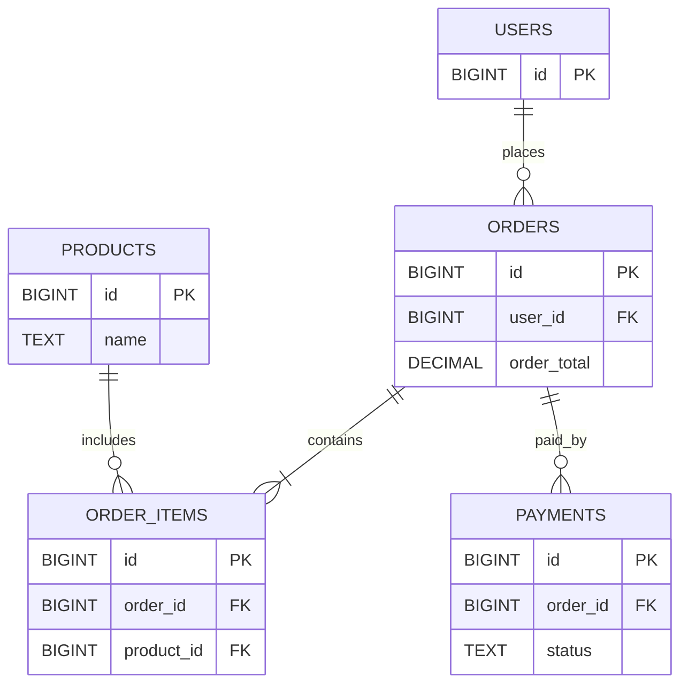

# Data Modeling

## Why it matters
Good models reduce bugs, simplify queries, and make future changes safer.

## Progression checkpoints
| Level | Focus |
| --- | --- |
| Beginner | Identify entities and relationships. |
| Intermediate | Normalize schemas and enforce constraints. |
| Senior | Decide when to denormalize for speed. |
| Principal | Define data ownership and model evolution standards. |

## Key concepts
- Normalization (1NF-3NF) vs denormalization.
- Entity relationships: one-to-one, one-to-many, many-to-many.
- Constraints: primary, foreign, unique, check.
- Data types and NULL handling.

## Detailed explanation
- **Normalization** reduces duplication and update anomalies. Denormalization
  is justified when read performance or analytics require it.
- **Relationship types** guide schema shape. Many-to-many needs join tables to
  preserve integrity.
- **Constraints** protect invariants (unique emails, non-negative balances).
- **NULL semantics** differ across databases; avoid NULL for fields that should
  always exist.

## Real-world example: Ecommerce orders
Users place orders with multiple items and payments. The model normalizes
products and order items, while denormalizing `order_total` for fast list views.

```sql
CREATE TABLE orders (
  id BIGINT PRIMARY KEY,
  user_id BIGINT NOT NULL,
  order_total DECIMAL(10,2) NOT NULL DEFAULT 0,
  created_at TIMESTAMP NOT NULL
);

CREATE TABLE order_items (
  id BIGINT PRIMARY KEY,
  order_id BIGINT NOT NULL REFERENCES orders(id),
  product_id BIGINT NOT NULL,
  quantity INT NOT NULL,
  unit_price DECIMAL(10,2) NOT NULL
);
```

## Diagram


## Additional real-world examples
- Denormalized order summary table used for dashboard views.
- Soft-delete flag added with a partial index for active rows only.
- Check constraints prevent negative inventory counts.

## Practical checklist
- Normalize by default; denormalize for proven access patterns.
- Use foreign keys and constraints to protect integrity.
- Document ownership and data contracts between teams.

## Official documentation
- https://www.postgresql.org/docs/current/ddl-constraints.html
- https://dev.mysql.com/doc/refman/8.0/en/constraint-enforcement.html
- https://www.mongodb.com/docs/manual/core/schema-validation/
