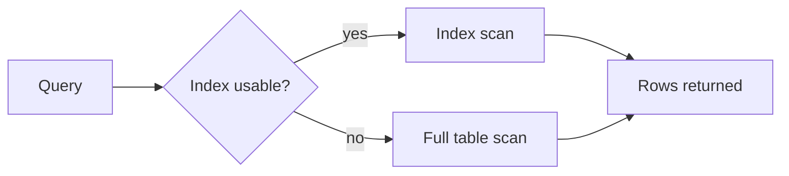

# Querying and Performance

## Why it matters
Performance issues are often data access problems. Indexing and query design
directly affect latency, cost, and user experience.

## Progression checkpoints
| Level | Focus |
| --- | --- |
| Beginner | Write correct queries and joins. |
| Intermediate | Use indexes and EXPLAIN to reduce scans. |
| Senior | Choose pagination and query patterns for scale. |
| Principal | Set performance budgets and query standards. |

## Key concepts
- Index types: B-tree, hash, composite, covering.
- Query plans and EXPLAIN output.
- Pagination: offset vs cursor.
- N+1 query pattern and query batching.

## Detailed explanation
- **B-tree indexes** are the default for range scans; **composite indexes**
  must match query predicates to be used effectively.
- **EXPLAIN** reveals scans, joins, and estimated rows; use it to confirm
  index usage before and after changes.
- **Cursor pagination** avoids large offsets that get slower as tables grow.
- **N+1 queries** often appear in ORMs; use preloading or batch queries.

## Real-world example: Support ticket search
A support tool lists open tickets ordered by newest first. Use a composite
index to avoid a full table scan and apply cursor-based pagination.

```sql
CREATE INDEX idx_tickets_status_created_at
ON tickets (status, created_at DESC);

SELECT id, subject, created_at
FROM tickets
WHERE status = 'open'
  AND created_at < :cursor
ORDER BY created_at DESC
LIMIT 50;
```

## Diagram


## Additional real-world examples
- Adding a covering index eliminates extra table lookups in a hot query.
- Full-text search moved to a dedicated index for faster support queries.
- Slow query log reveals a missing index on a foreign key column.

## Practical checklist
- Index columns used in WHERE and ORDER BY together.
- Use cursor pagination for large datasets.
- Inspect query plans and track slow queries over time.

## Official documentation
- https://www.postgresql.org/docs/current/using-explain.html
- https://dev.mysql.com/doc/refman/8.0/en/explain.html
- https://www.sqlite.org/eqp.html
