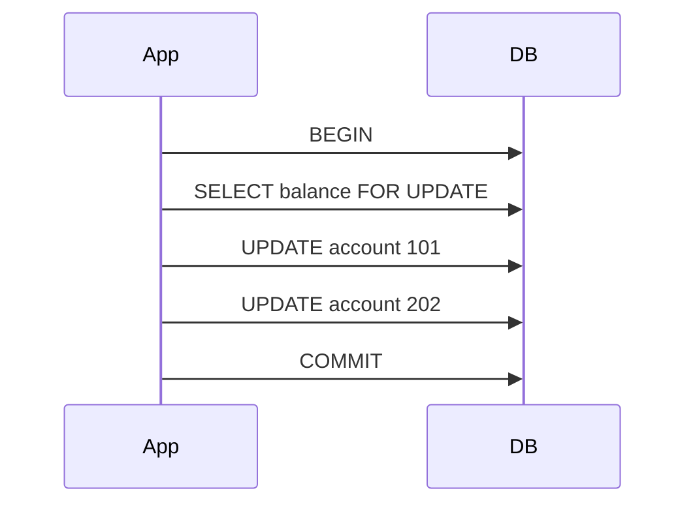

# Transactions and Consistency

## Why it matters
Transactions protect correctness when multiple changes must succeed or fail
together. Understanding isolation avoids subtle data bugs.

## Progression checkpoints
| Level | Focus |
| --- | --- |
| Beginner | Use transactions for multi-step updates. |
| Intermediate | Understand isolation levels and anomalies. |
| Senior | Choose optimistic vs pessimistic locking. |
| Principal | Define consistency guarantees and retry policies. |

## Key concepts
- ACID properties and transaction boundaries.
- Isolation levels and anomalies (dirty read, non-repeatable read, phantom).
- Locks, deadlocks, optimistic vs pessimistic concurrency.
- Idempotency and retry-safe operations.

## Real-world example: Wallet transfer
Transfer funds between two accounts in a single transaction.

```sql
BEGIN;
SELECT balance FROM accounts WHERE id = 101 FOR UPDATE;
UPDATE accounts SET balance = balance - 100 WHERE id = 101;
UPDATE accounts SET balance = balance + 100 WHERE id = 202;
COMMIT;
```

## Diagram


## Practical checklist
- Keep transactions short to reduce lock contention.
- Handle retries for serialization or deadlock errors.
- Use idempotency keys for external-facing write APIs.
