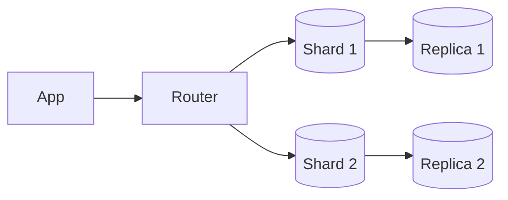

# Scaling and Distributed Data

## Why it matters
As traffic grows, single-node databases become bottlenecks. Scaling requires
careful tradeoffs around consistency, latency, and operational complexity.

## Progression checkpoints
| Level | Focus |
| --- | --- |
| Beginner | Understand replicas and basic sharding ideas. |
| Intermediate | Route reads and writes correctly. |
| Senior | Plan partition keys and rebalancing. |
| Principal | Set consistency and availability standards. |

## Key concepts
- Read replicas and write scaling.
- Sharding and partitioning strategies.
- Consistent hashing and rebalancing.
- Replication lag and read-your-writes issues.

## Real-world example: Social app scaling
User data is sharded by `user_id`, with read replicas for feed reads.

## Practical checklist
- Choose shard keys that balance load and avoid hot spots.
- Decide which reads can tolerate replica lag.
- Plan resharding and migration paths early.
