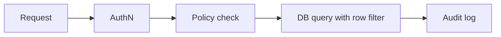

# Security and Governance

## Why it matters
Databases often store the most sensitive data. Security and governance protect
users, reduce risk, and ensure compliance.

## Progression checkpoints
| Level | Focus |
| --- | --- |
| Beginner | Apply basic access controls and secrets handling. |
| Intermediate | Use encryption and role-based access. |
| Senior | Implement row-level security and audit trails. |
| Principal | Define data policies and compliance standards. |

## Key concepts
- Least privilege and role-based access control (RBAC).
- Encryption in transit and at rest.
- Row-level security and tenant isolation.
- Data retention, deletion, and audit logging.

## Real-world example: Healthcare data access
Clinicians can only access patients they are assigned to, with audited access.

## Practical checklist
- Rotate credentials and manage secrets centrally.
- Encrypt backups and verify key rotation procedures.
- Define retention and deletion timelines for PII.
