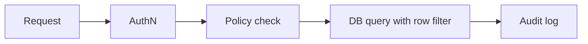

# Security and Governance

## Why it matters
Databases often store the most sensitive data. Security and governance protect
users, reduce risk, and ensure compliance.

## Progression checkpoints
| Level | Focus |
| --- | --- |
| Beginner | Apply basic access controls and secrets handling. |
| Intermediate | Use encryption and role-based access. |
| Senior | Implement row-level security and audit trails. |
| Principal | Define data policies and compliance standards. |

## Key concepts
- Least privilege and role-based access control (RBAC).
- Encryption in transit and at rest.
- Row-level security and tenant isolation.
- Data retention, deletion, and audit logging.

## Detailed explanation
- **Least privilege** limits blast radius. Separate read/write roles and avoid
  shared admin accounts.
- **Encryption** should cover transit (TLS) and storage (disk, backups).
- **Row-level security** enforces tenant isolation inside the database, not
  just in application logic.
- **Retention and deletion** policies support compliance and reduce risk.

## Real-world example: Healthcare data access
Clinicians can only access patients they are assigned to, with audited access.

## Additional real-world examples
- Separate analytics role with masked PII to reduce exposure.
- Row-level policies restrict multi-tenant access to a single tenant ID.
- Audit logs exported to immutable storage for compliance reviews.

## Practical checklist
- Rotate credentials and manage secrets centrally.
- Encrypt backups and verify key rotation procedures.
- Define retention and deletion timelines for PII.

## Official documentation
- https://www.postgresql.org/docs/current/ddl-rowsecurity.html
- https://dev.mysql.com/doc/refman/8.0/en/innodb-data-encryption.html
