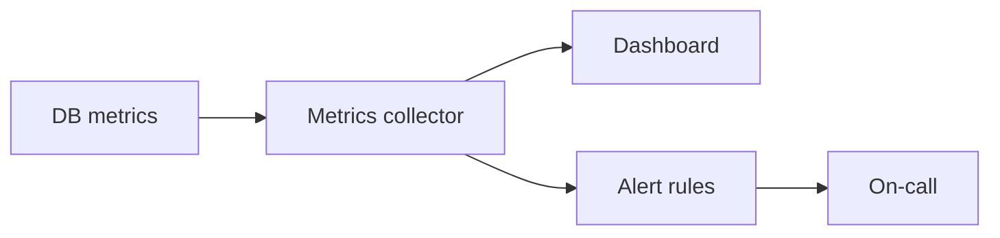

# Observability and Operations

## Why it matters
Without visibility, database issues become outages. Observability enables early
warnings, capacity planning, and faster recovery.

## Progression checkpoints
| Level | Focus |
| --- | --- |
| Beginner | Track basic metrics and logs. |
| Intermediate | Monitor slow queries and index usage. |
| Senior | Define SLOs and run capacity reviews. |
| Principal | Standardize dashboards and alert policies. |

## Key concepts
- Metrics: latency, throughput, errors, saturation.
- Slow query logs and query analytics.
- Index usage, bloat, and vacuum metrics.
- Capacity planning and forecasting.

## Detailed explanation
- **Latency and throughput** reveal performance regressions; track per-query
  p95/p99 to catch hotspots.
- **Slow query logs** highlight missing indexes and expensive joins.
- **Bloat and vacuum** metrics indicate storage inefficiency and cleanup needs.
- **Capacity forecasting** uses growth trends to plan storage and replica needs.

## Real-world example: Marketplace latency alerts
The marketplace alerts on p99 query latency and replica lag during sales peaks.

## Additional real-world examples
- Alert on replication lag when a replica falls behind during peak traffic.
- Weekly review of top 10 slow queries to prioritize fixes.
- Storage alerts trigger before disk reaches 80 percent utilization.

## Practical checklist
- Track p95 and p99 query latency per service.
- Alert on replica lag and storage utilization.
- Review slow query logs weekly.

## Official documentation
- https://www.postgresql.org/docs/current/monitoring-stats.html
- https://dev.mysql.com/doc/refman/8.0/en/performance-schema.html
