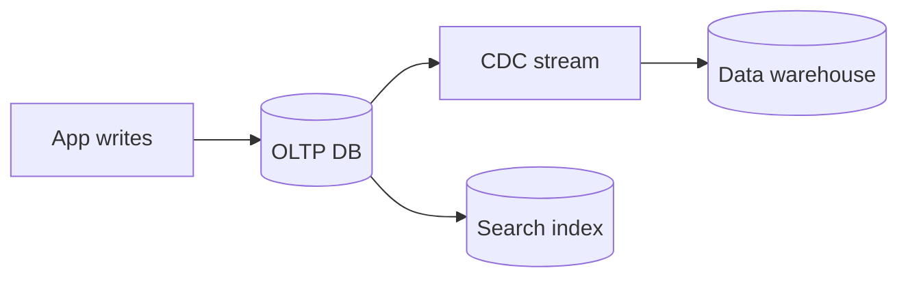

# Specialized Datastores

## Why it matters
Not every workload fits a relational database. Specialized stores solve
specific problems more efficiently.

## Progression checkpoints
| Level | Focus |
| --- | --- |
| Beginner | Know common datastore types and use cases. |
| Intermediate | Choose OLTP vs OLAP based on workload. |
| Senior | Combine stores safely with clear ownership. |
| Principal | Define data platform strategy and governance. |

## Key concepts
- OLTP vs OLAP vs HTAP.
- Search, time-series, graph, and document stores.
- Cache vs DB vs search tradeoffs.
- Data pipelines and consistency boundaries.

## Real-world example: Analytics and search
Transactional data is stored in OLTP, then streamed to a warehouse for BI.
Search uses an index optimized for full-text queries.

## Practical checklist
- Pick the simplest store that meets requirements.
- Document data ownership and sync guarantees.
- Measure cost and operational overhead per store.
