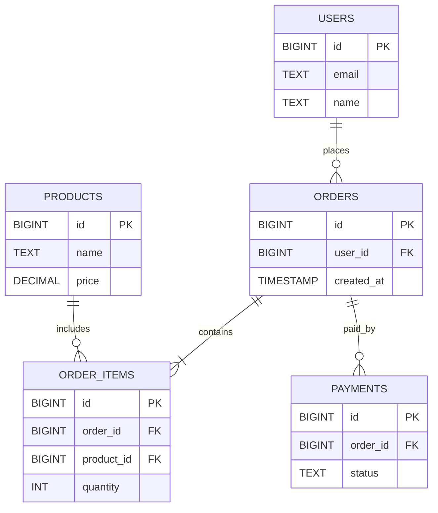
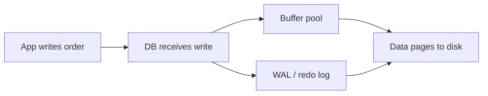
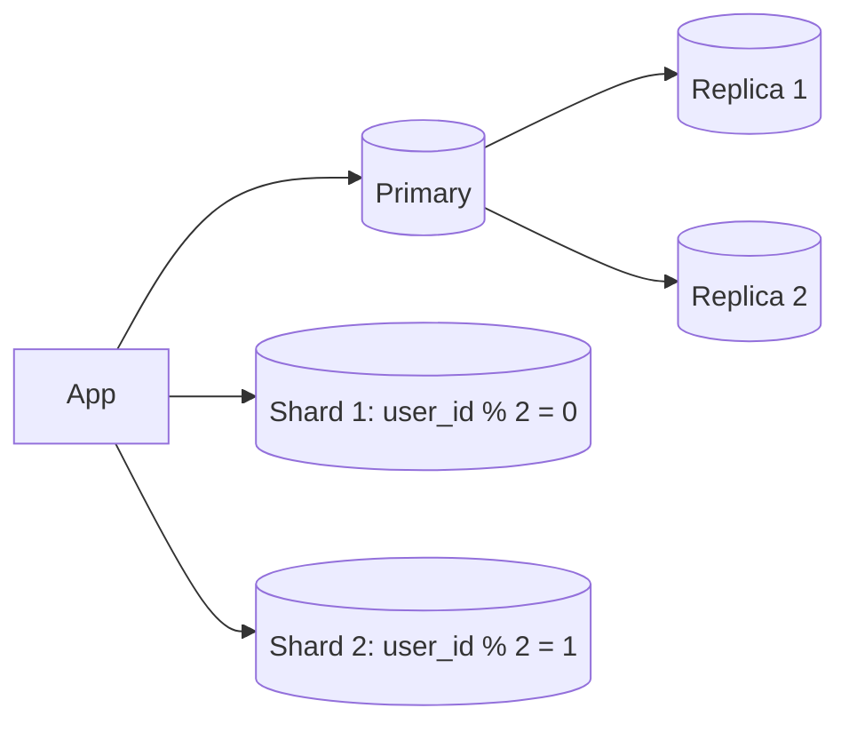
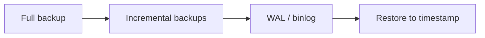
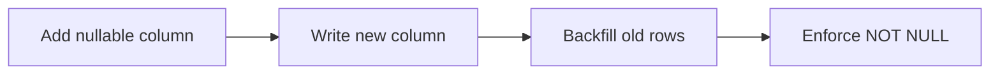

# Databases and Data Modeling

This module builds database mastery from beginner to principal. It focuses on
data modeling, performance, reliability, and governance with real-world
examples and production-ready patterns.

## Progression expectations

| Level | Outcomes |
| --- | --- |
| Beginner | Model entities and write basic SQL queries. |
| Intermediate | Use indexes, transactions, and normalization effectively. |
| Senior | Plan migrations, tune queries, and handle replication. |
| Principal | Select tech, define data ownership, and plan DR. |

## Contents
1. Fundamentals (Beginner)
2. Data Modeling (Intermediate)
3. Querying and Performance
4. Transactions and Consistency
5. Storage Engines and Internals
6. Scaling and Distributed Data
7. Reliability and Disaster Recovery
8. Migrations and Schema Evolution
9. Security and Governance
10. Observability and Operations
11. Specialized Datastores (Advanced)

---

## 1) Fundamentals (Beginner)

**Key concepts**
- Relational vs NoSQL: when and why.
- Tables, rows, columns, primary and foreign keys.
- Basic SQL: SELECT/INSERT/UPDATE/DELETE.
- Joins, grouping, aggregation.

**Real-world example**
- **User profile service** for a SaaS app: a `users` table stores profile data,
  and a `teams` table stores organization membership.

```sql
CREATE TABLE users (
  id BIGINT PRIMARY KEY,
  email TEXT UNIQUE NOT NULL,
  name TEXT NOT NULL,
  created_at TIMESTAMP NOT NULL
);

SELECT id, email, name
FROM users
WHERE email = 'ada@example.com';
```

---

## 2) Data Modeling (Intermediate)

**Key concepts**
- Normalization (1NF-3NF) vs denormalization.
- Entity relationships and constraints.
- Choosing data types and handling NULLs.

**Real-world example**
- **Ecommerce domain** with users, orders, and products.



---

## 3) Querying and Performance

**Key concepts**
- Index types: B-tree, hash, composite, covering.
- Query plans and `EXPLAIN`.
- Pagination: offset vs cursor.

**Real-world example**
- **Support ticket search**: filter by `status` and `created_at` with an index.

```sql
CREATE INDEX idx_tickets_status_created_at
ON tickets (status, created_at DESC);

EXPLAIN
SELECT id, subject
FROM tickets
WHERE status = 'open'
ORDER BY created_at DESC
LIMIT 50;
```

---

## 4) Transactions and Consistency

**Key concepts**
- ACID properties.
- Isolation levels and anomalies.
- Locks, deadlocks, optimistic vs pessimistic concurrency.

**Real-world example**
- **Wallet transfer** between two accounts.

```sql
BEGIN;
UPDATE accounts SET balance = balance - 100 WHERE id = 101;
UPDATE accounts SET balance = balance + 100 WHERE id = 202;
COMMIT;
```

---

## 5) Storage Engines and Internals

**Key concepts**
- WAL/redo logs, checkpoints.
- Buffer pool and caching.
- How indexes are stored and maintained.

**Real-world example**
- **Order service** chooses InnoDB for crash recovery and row-level locking.



---

## 6) Scaling and Distributed Data

**Key concepts**
- Read replicas and write scaling.
- Sharding and partitioning.
- Consistent hashing and rebalancing.

**Real-world example**
- **Social app** shards users by `user_id` and reads from replicas.



---

## 7) Reliability and Disaster Recovery

**Key concepts**
- Backups: full, incremental, point-in-time recovery (PITR).
- RPO and RTO targets.
- Multi-region replication.

**Real-world example**
- **Payment system** restores from PITR after a bad migration.



---

## 8) Migrations and Schema Evolution

**Key concepts**
- Expand/contract patterns.
- Backward compatible changes.
- Long-running backfills.

**Real-world example**
- **Add nullable column** then backfill before making it NOT NULL.



---

## 9) Security and Governance

**Key concepts**
- Least privilege and RBAC.
- Encryption in transit and at rest.
- PII handling, retention, and deletion.

**Real-world example**
- **Healthcare app** encrypts patient records and enforces row-level security.

---

## 10) Observability and Operations

**Key concepts**
- Metrics: latency, throughput, errors, saturation.
- Slow query logs and index usage.
- Capacity planning and forecasting.

**Real-world example**
- **Marketplace** alerts on 99th percentile query latency and replica lag.

---

## 11) Specialized Datastores (Advanced)

**Key concepts**
- OLTP vs OLAP vs HTAP.
- Search, time-series, graph, and document stores.
- Cache vs DB vs search tradeoffs.

**Real-world example**
- **Analytics pipeline** writes to OLTP, then streams to a warehouse for BI.

---

## Suggested artifacts (by level)
- Beginner: simple schema + CRUD queries.
- Intermediate: ER diagram + normalization notes.
- Senior: performance report with `EXPLAIN` and indexes.
- Principal: data ownership map, DR plan, and migration strategy.
