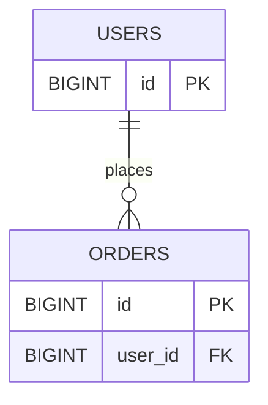

# Resource Modeling and Naming

## Why it matters
Good resource models make APIs intuitive and consistent across teams.

## Progression checkpoints
| Level | Focus |
| --- | --- |
| Beginner | Map entities to resources. |
| Intermediate | Design hierarchical relationships. |
| Senior | Avoid deep nesting and ambiguous names. |
| Principal | Define org-wide naming standards. |

## Key concepts
- Resource nouns vs action verbs.
- Hierarchical URLs and ownership.
- Pluralization and consistency.
- Avoiding overly nested routes.

## Real-world example: Orders API
Orders belong to users but should be queried independently for admin tools.

```
GET /users/{id}/orders
GET /orders/{order_id}
```

## Diagram


## Practical checklist
- Prefer nouns for resources.
- Keep nesting to two levels max.
- Document ownership and relationships.
